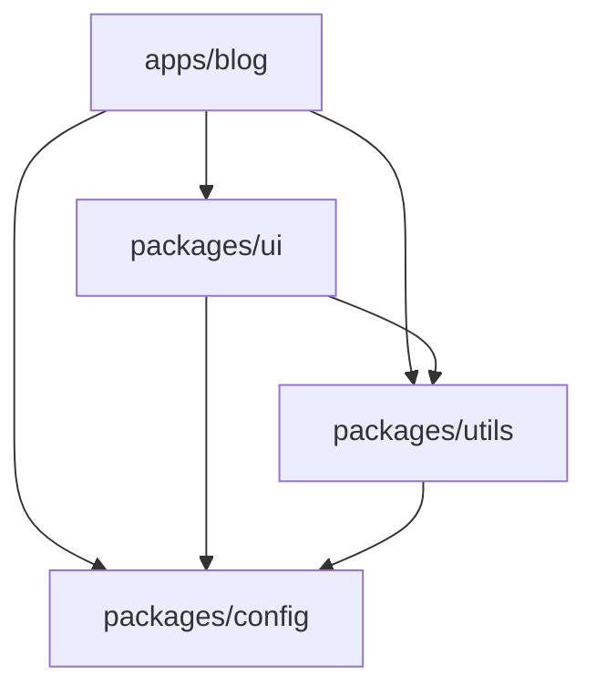

# Architecture Design

新機能・システムのアーキテクチャ設計を支援するスキル。

## プロジェクト構成

このプロジェクトは Turborepo + pnpm workspaces の monorepo 構成。

```text
/
├── apps/
│   └── blog/                   # @blog/web - Next.js ブログアプリ
├── packages/
│   ├── ui/                     # @blog/ui - 共通 UI コンポーネント
│   ├── config/                 # @blog/config - 共通設定
│   └── utils/                  # @blog/utils - 共通ユーティリティ
└── infra/terraform/            # インフラ定義
```

## 設計原則

### 1. パッケージ分離

| 配置場所         | 用途                               |
| ---------------- | ---------------------------------- |
| apps/            | デプロイ可能なアプリケーション     |
| packages/ui/     | 再利用可能な UI コンポーネント     |
| packages/utils/  | ビジネスロジック・ユーティリティ   |
| packages/config/ | 共通設定（tsconfig, biome等）      |

### 2. 依存関係の方向



- apps は packages に依存可能
- packages 間の依存は ui → utils → config の順
- 循環依存は禁止

### 3. 技術スタック

- **フロントエンド**: Next.js 15, React 18, Tailwind CSS
- **ビルド**: Turborepo（キャッシュ・並列実行）
- **リンター**: Biome（ESLint/Prettier 不使用）
- **テスト**: Playwright（E2E）
- **インフラ**: Terraform（AWS, CloudFlare, Vercel）

## 設計ドキュメント テンプレート

```markdown
# {機能名} 設計書

## 概要

- 目的:
- スコープ:

## 要件

### 機能要件

1. ...

### 非機能要件

1. ...

## アーキテクチャ

### コンポーネント図

\`\`\`mermaid
graph TD
    ...
\`\`\`

### シーケンス図

\`\`\`mermaid
sequenceDiagram
    ...
\`\`\`

## 実装計画

### 影響範囲

- 新規ファイル:
- 変更ファイル:

### 依存パッケージ

- ...

## リスクと対策

| リスク | 影響度 | 対策 |
| ------ | ------ | ---- |
| ...    | 高/中/低 | ... |

## 代替案

1. ...
```

## 手順

1. 要件のヒアリング
2. 既存アーキテクチャとの整合性確認
3. Mermaid 図で構成を可視化
4. 影響範囲の特定
5. 設計ドキュメントの作成

## Mermaid 図の種類

| 用途             | 図の種類        |
| ---------------- | --------------- |
| システム構成     | graph TD/LR     |
| 処理フロー       | flowchart       |
| API 呼び出し順序 | sequenceDiagram |
| 状態遷移         | stateDiagram    |
| クラス関係       | classDiagram    |
| ER 図            | erDiagram       |

## 注意事項

- 既存パターンに従う（新しいパターンは慎重に）
- 過度な抽象化を避ける
- パッケージ間の依存は最小限に
- 破壊的変更は事前に影響範囲を明確化
