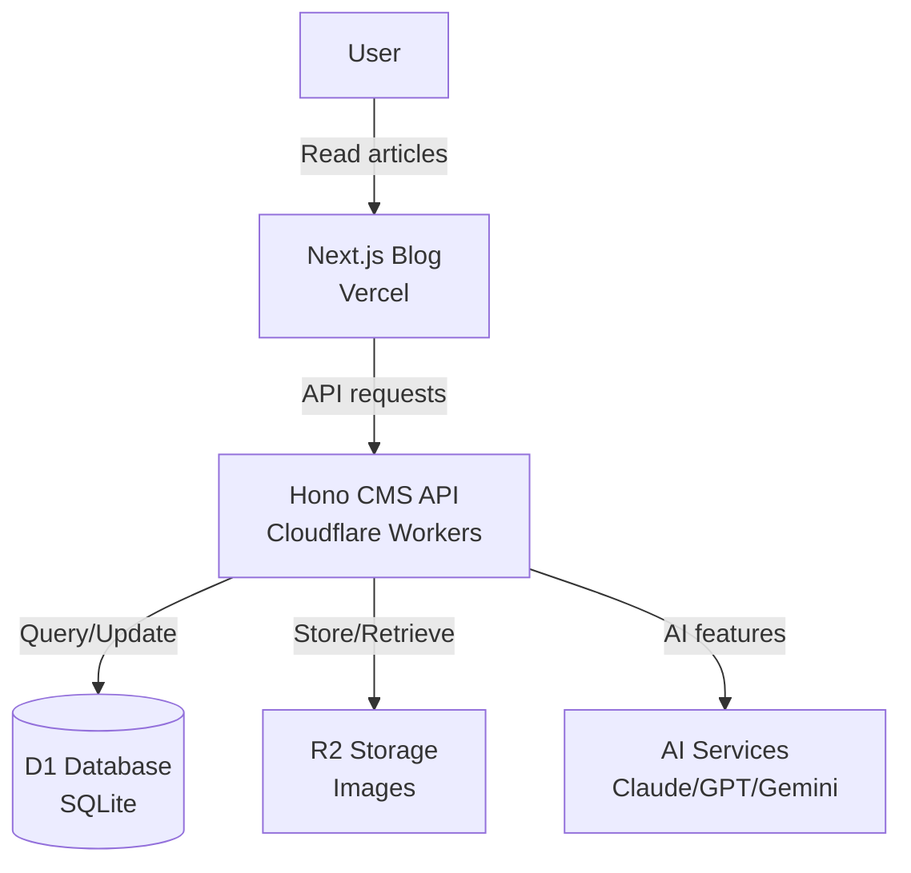
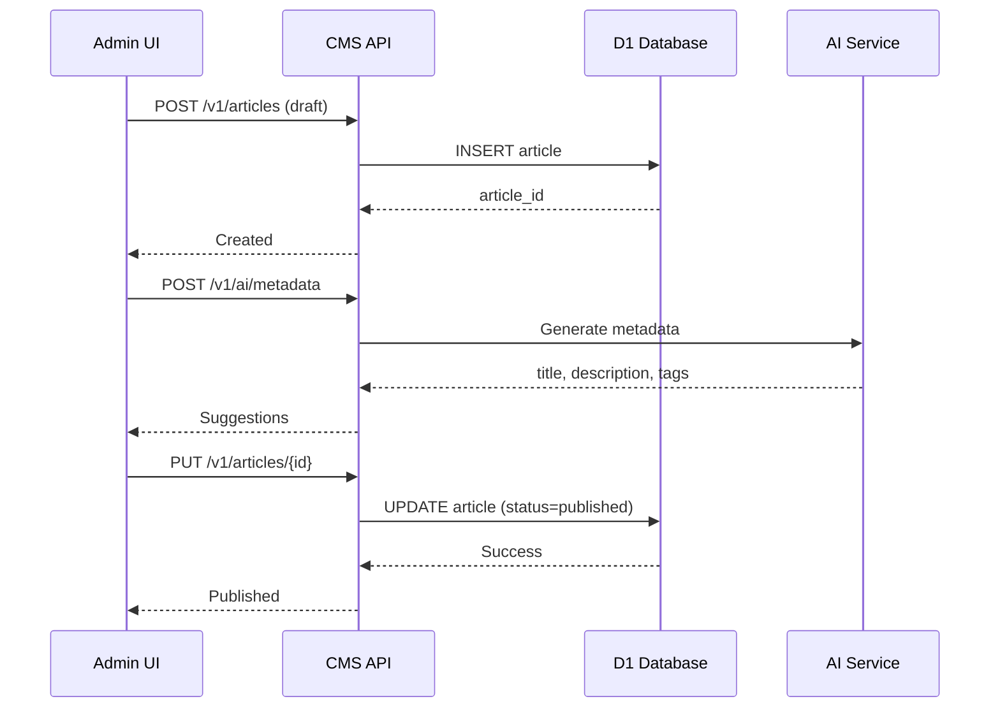
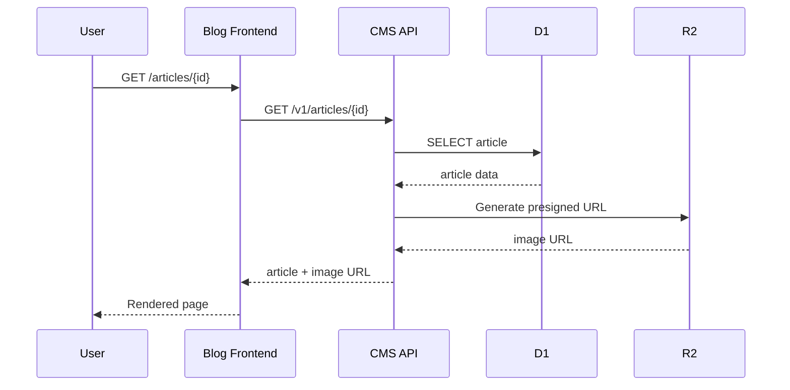
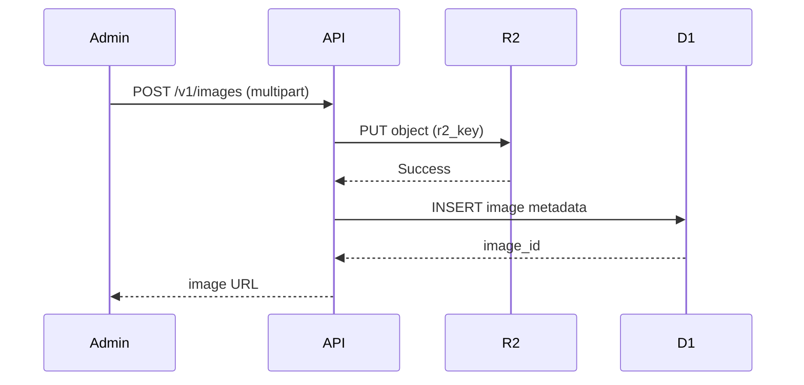
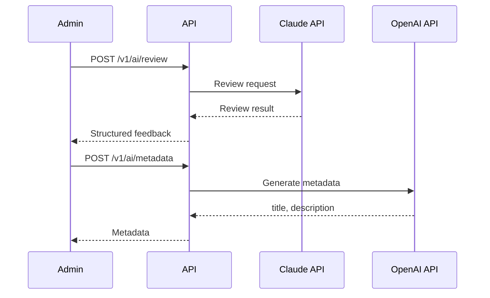
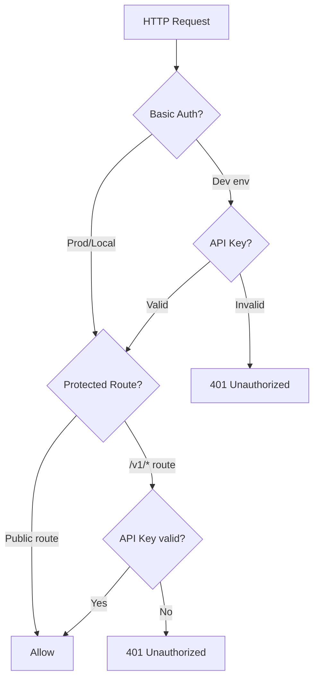
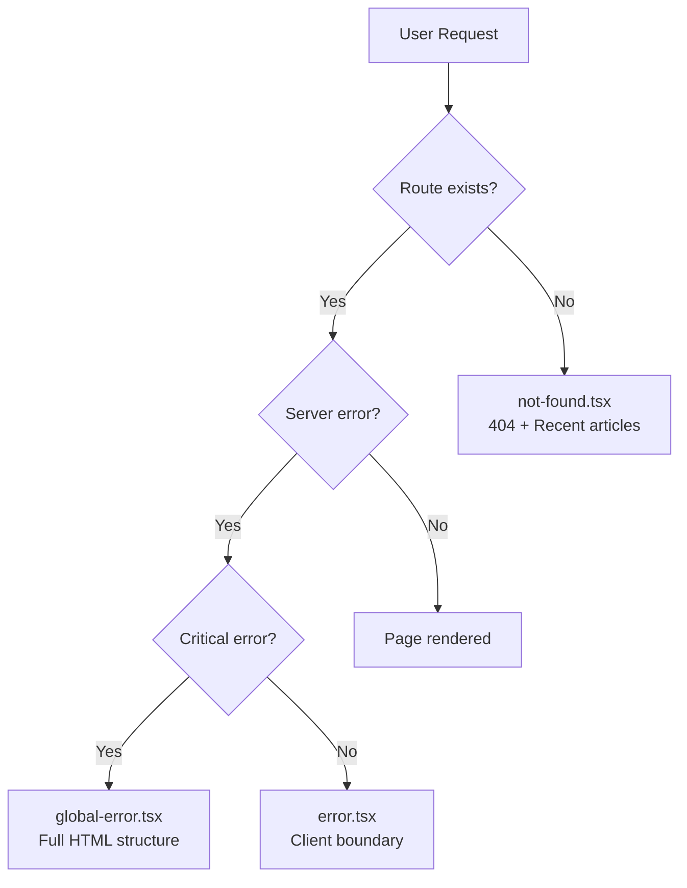
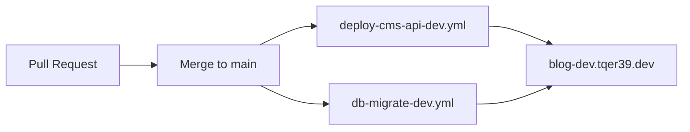
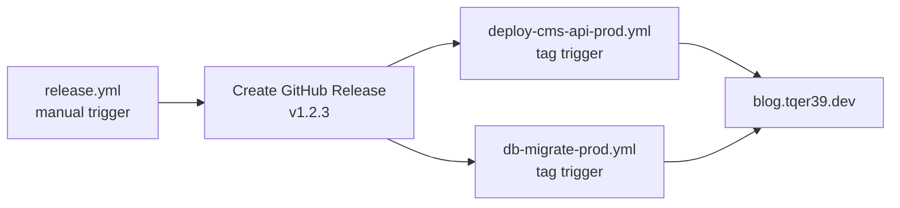
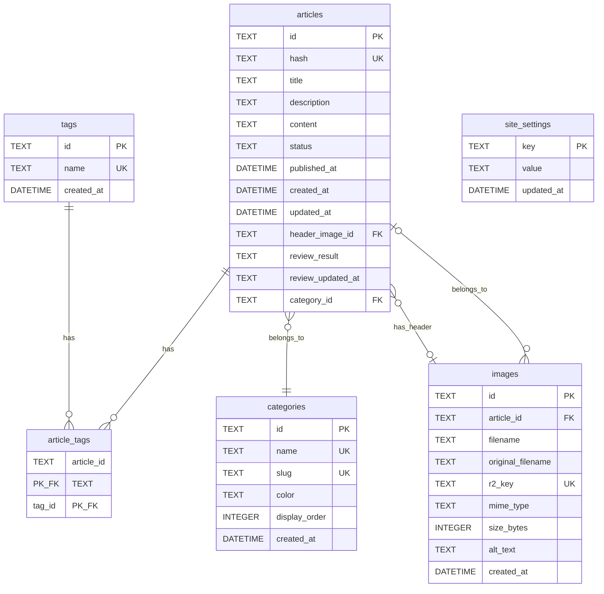

# Architecture Guide

[🇯🇵 日本語版](docs/ARCHITECTURE.ja.md)

> **Purpose**: Record system design decisions, trade-offs, and context
> **Target Audience**: Future self (6+ months later), new contributors
> **Last Updated**: 2026-01-14

## Table of Contents

1. [System Overview](#system-overview)
2. [Architecture Principles](#architecture-principles)
3. [System Components](#system-components)
4. [Data Flow & Interactions](#data-flow--interactions)
5. [Authentication & Security](#authentication--security)
6. [Error Handling Strategy](#error-handling-strategy)
7. [Deployment Architecture](#deployment-architecture)
8. [Database Schema](#database-schema)
9. [API Structure](#api-structure)
10. [Key Design Patterns](#key-design-patterns)
11. [Performance Considerations](#performance-considerations)
12. [Development Workflow](#development-workflow)
13. [Related Documentation](#related-documentation)

---

## System Overview

Personal blog service built with a serverless-first approach, designed for minimal
maintenance and maximum performance. The system consists of a Next.js blog frontend
on Vercel and a Hono-based CMS API on Cloudflare Workers, with AI-assisted content
creation.

**Core Philosophy**: Minimal, fast, personal blog with AI assistance



### Why This Architecture?

- **Serverless-first**: Zero server maintenance, automatic scaling
- **Next.js 15**: App Router for optimal performance with Server Components
- **Hono on Workers**: Lightning-fast edge compute with global distribution
- **Cloudflare stack**: D1 (SQLite) + R2 (object storage) for serverless database and storage
- **AI integration**: Claude for content review, GPT for metadata, Gemini for images

---

## Architecture Principles

### 1. Monorepo Structure (Turborepo + pnpm)

**Decision**: Use a monorepo to share code between blog frontend and CMS API

**Rationale**:
- Type safety across frontend/backend via shared `@blog/cms-types`
- Reusable UI components in `@blog/ui`
- Centralized configuration in `@blog/config`
- Single dependency management with pnpm workspaces

**Trade-offs**:
- ✅ Easier refactoring across services
- ✅ Consistent tooling and dependencies
- ⚠️ Slightly more complex initial setup

### 2. ULID-based Permanent URLs

**Decision**: Use ULID for article IDs, forming permanent URLs (`/articles/{ULID}`)

**Rationale**:
- URLs never change, even if title/category changes
- Time-sortable without database queries
- No slug collisions

**Trade-offs**:
- ✅ Permanent links (SEO-friendly)
- ✅ No slug management overhead
- ⚠️ Less readable URLs (but not important for personal blog)

### 3. Serverless Backend on Workers

**Decision**: Run CMS API on Cloudflare Workers instead of traditional servers

**Rationale**:
- Global edge distribution (low latency worldwide)
- Zero server maintenance
- Pay-per-request pricing (cost-effective for personal blog)

**Limitations**:
- No Node.js standard library (but Hono abstracts most concerns)
- 10ms CPU time limit per request (sufficient for API operations)

### 4. Static Metadata in packages/config

**Decision**: Centralize environment constants and configuration

**Rationale**:
- Single source of truth for ports, domains, CORS origins
- Type-safe configuration shared across services
- Easy environment switching

### 5. User-Friendly Error Pages Philosophy

**Decision**: Error pages (404, error boundary) prioritize user experience over technical details

**Recent implementation (2026-01-14)**:
- 404 page shows 3 recent articles to help users find content
- Error boundaries provide "retry" and "go home" actions
- Global error handler catches root layout errors

**Rationale**:
- Lost users should be redirected to valuable content
- Graceful degradation (404 shows articles only if API succeeds)
- Consistent "Notepad + Index" minimalist design

### 6. "Notepad + Index" UI Design

**Decision**: Minimalist design focused on readability

**Principles**:
- No flashy animations or decorations
- Content-first layout
- Code blocks are collapsible for better scanning
- Tailwind CSS with typography plugin for prose content

---

## System Components

### Frontend (apps/blog)

**Tech**: Next.js 15 with App Router, React Server Components

#### App Router Structure

```text
app/
├── (public)/
│   ├── page.tsx              # Homepage (latest 5 articles)
│   ├── articles/
│   │   ├── page.tsx          # Article list
│   │   └── [id]/page.tsx     # Article detail
│   ├── about/page.tsx        # About page
│   └── layout.tsx            # Public layout (header, footer)
├── admin/
│   ├── login/page.tsx        # Admin login
│   ├── articles/
│   │   ├── page.tsx          # Admin article list
│   │   └── [id]/page.tsx     # Admin editor
│   └── layout.tsx            # Admin layout (protected)
├── error.tsx                 # Client-side error boundary
├── global-error.tsx          # Global error handler
├── not-found.tsx             # 404 page (with recent articles)
└── layout.tsx                # Root layout
```

#### Server vs Client Components Strategy

- **Server Components (default)**: Article pages, homepage, layouts
- **Client Components**: Admin editor, interactive UI (modals, forms)
- **Benefits**: Smaller JS bundles, faster initial page loads

#### Component Hierarchy

```text
components/
├── ArticleCard.tsx           # Article preview card
├── CategoryBadge.tsx         # Category tag
├── JsonLd.tsx               # Structured data for SEO
├── MarkdownRenderer.tsx      # Article content renderer
├── Header.tsx               # Site header
└── Footer.tsx               # Site footer
```

#### Error Boundaries

**Implemented 2026-01-14**:

1. **not-found.tsx** (404 page)
   - Displays "page not found" message
   - Shows 3 most recent articles (if API succeeds)
   - Links to homepage and article list
   - SEO: `noindex, nofollow`

2. **error.tsx** (client-side error boundary)
   - Catches runtime errors in page components
   - Provides "retry" button to reset error state
   - Logs errors in development mode
   - Links to homepage

3. **global-error.tsx** (global error handler)
   - Catches errors in root layout
   - Renders full HTML structure (`<html>`, `<body>`)
   - Dark mode support
   - Last resort error page

### Backend (apps/cms-api)

**Tech**: Hono on Cloudflare Workers

#### Application Structure

```text
src/
├── index.ts                  # Entry point, middleware stack
├── handlers/
│   ├── articles.ts          # Article CRUD
│   ├── ai.ts                # AI features
│   ├── images.ts            # Image upload/delete
│   ├── categories.ts        # Category management
│   ├── tags.ts              # Tag management
│   ├── settings.ts          # Site settings
│   └── webhook.ts           # External webhooks
├── middleware/
│   ├── basicAuth.ts         # Dev environment protection
│   ├── auth.ts              # API key validation
│   ├── rateLimit.ts         # Rate limiting
│   └── cors.ts              # CORS configuration
└── lib/
    └── exceptions.ts         # ApiException class
```

#### Middleware Stack

```typescript
// index.ts
app.use('*', logger());
app.use('*', basicAuth);      // Dev only
app.use('*', rateLimit);      // All environments
app.use('*', corsMiddleware); // CORS headers
```

#### Handler Organization

- **Public endpoints**: `/health`, `/v1/settings`, `/v1/images/file/*` (dev only)
- **Authenticated endpoints**: `/v1/*` (requires API key)

#### Error Handling

- **ApiException**: Structured error responses with code, message, details
- **Global error handler**: Catches unexpected errors, hides details in production

```typescript
// Error response format
{
  "error": {
    "code": "NOT_FOUND",
    "message": "Article not found",
    "details": { ... } // Optional
  }
}
```

### Data Layer

#### D1 Database (SQLite)

**Migrations**:
- `001_init.sql`: Initial schema (articles, tags, images, site_settings)
- `002_categories.sql`: Category support

**Key Features**:
- Automatically updated timestamps via triggers
- Foreign key constraints for data integrity
- Indexes for performance

#### R2 Object Storage

**Purpose**: Store article header images and inline images

**Strategy**:
- Images uploaded via CMS API
- Metadata stored in D1 `images` table
- Delivery via presigned URLs (1-hour expiry) or CDN

**URL Priority**:
1. Presigned URL (private buckets)
2. `R2_PUBLIC_URL` (public buckets)
3. Local dev endpoint (`/v1/images/file/*`)
4. CDN URL (`cdn.tqer39.dev`)

### AI Integration

**Models by Use Case**:

| Model          | Provider  | Use Case                           | Why?                    |
| -------------- | --------- | ---------------------------------- | ----------------------- |
| Claude Sonnet  | Anthropic | Review, outline, transform, etc.   | Best reasoning quality  |
| GPT-4o-mini    | OpenAI    | Metadata generation                | Fast, cost-effective    |
| Gemini         | Google    | Header image generation            | Good image understanding|

**Features**:
- **Review**: Analyze article structure, suggest improvements
- **Outline**: Generate article outlines from topics
- **Metadata**: Auto-generate title, description, tags
- **Transform**: Rewrite content in different styles
- **Continuation**: Suggest next paragraphs
- **Image**: Generate header images with prompts

See [AI-INTEGRATION.md](docs/AI-INTEGRATION.md) for detailed documentation.

---

## Data Flow & Interactions

### 1. Article Creation Flow



### 2. Article Display Flow



### 3. Image Upload Flow



### 4. AI Assistance Flow



---

## Authentication & Security

### Three-Layer Authentication



### 1. Basic Auth (Dev Only)

**Purpose**: Prevent unauthorized access to dev environment

**Environment**: `ENVIRONMENT=dev`

**Credentials**:
- Username: `BASIC_AUTH_USER`
- Password: `BASIC_AUTH_PASSWORD`

**Protected**: All CMS API endpoints in dev

### 2. API Key (CMS API)

**Purpose**: Authenticate requests to CMS API

**Header**: `x-api-key: {API_KEY}`

**Protected**: All `/v1/*` routes except public endpoints

**Public endpoints** (no API key required):
- `GET /health`
- `GET /v1/settings`
- `GET /v1/images/file/*` (local dev only)

### 3. Password (Admin UI)

**Purpose**: Protect admin dashboard

**Environment Variable**: `ADMIN_PASSWORD`

**Flow**:
1. Admin navigates to `/admin`
2. Redirected to `/admin/login`
3. Submit password
4. Session stored in browser

---

## Error Handling Strategy

### HTTP Error Pages (Implemented 2026-01-14)



#### not-found.tsx (404 Page)

**Features**:
- "Page not found" message with explanation
- Links to homepage and article list
- Shows 3 most recent articles (if API succeeds)
- Graceful degradation: hides article section if API fails

**SEO**: `noindex, nofollow`

**Code pattern**:
```typescript
export default async function NotFound() {
  const result = await getAllArticles();
  const recentArticles = result.ok ? result.data.slice(0, 3) : [];
  // Conditional rendering based on recentArticles.length
}
```

#### error.tsx (Client-Side Error Boundary)

**Features**:
- Catches runtime errors in page components
- Logs error to console (dev mode)
- "Retry" button to reset error state
- "Go home" link

**Requirements**: Must be a Client Component (`'use client'`)

#### global-error.tsx (Global Error Handler)

**Features**:
- Catches errors in root layout
- Renders full HTML structure (including `<html>` and `<body>`)
- Dark mode support via `suppressHydrationWarning`
- Simplest possible error page (no dependencies)

**When triggered**: Root layout errors, critical failures

### API Error Handling

**ApiException class** (structured errors):
```typescript
throw new ApiException(404, 'NOT_FOUND', 'Article not found', { id });
```

**Error response format**:
```json
{
  "error": {
    "code": "NOT_FOUND",
    "message": "Article not found",
    "details": { "id": "01HXQ..." }
  }
}
```

**Production error hiding**:
- Detailed error messages only in dev/local
- Generic "An unexpected error occurred" in production

---

## Deployment Architecture

### Three-Environment Structure

```text
┌─────────────────┬─────────────────────────┬───────────────────────────────┐
│      Local      │           Dev           │             Prod              │
├─────────────────┼─────────────────────────┼───────────────────────────────┤
│ Blog:           │ Blog:                   │ Blog:                         │
│ localhost:3100  │ blog-dev.tqer39.dev     │ blog.tqer39.dev               │
├─────────────────┼─────────────────────────┼───────────────────────────────┤
│ CMS API:        │ CMS API:                │ CMS API:                      │
│ localhost:3101  │ cms-api-dev.tqer39      │ cms-api.tqer39.workers.dev    │
│                 │ .workers.dev            │                               │
├─────────────────┼─────────────────────────┼───────────────────────────────┤
│ CDN/R2:         │ CDN/R2:                 │ CDN/R2:                       │
│ localhost:3102  │ cdn.tqer39.dev          │ cdn.tqer39.dev                │
├─────────────────┼─────────────────────────┼───────────────────────────────┤
│ D1: local       │ blog-cms-dev            │ blog-cms-prod                 │
│ R2: local       │ blog-images-dev         │ blog-images-prod              │
├─────────────────┼─────────────────────────┼───────────────────────────────┤
│ No Auth         │ Basic Auth + API Key    │ No Auth (public) + API Key    │
└─────────────────┴─────────────────────────┴───────────────────────────────┘
```

### CI/CD Flow

#### Development Deployment (Auto)



**Triggers**:
- Push to `main` branch
- Deploys CMS API to `cms-api-dev`
- Runs migrations on `blog-cms-dev` D1 database

#### Production Deployment (Manual)



**Steps**:
1. Manually run `release.yml` workflow
2. Creates GitHub Release with semantic version tag (e.g., `v1.2.3`)
3. Tag triggers production deployment workflows
4. Blog auto-deploys via Vercel (connected to main branch)

### Hosting

| Component | Provider            | Service                |
| --------- | ------------------- | ---------------------- |
| Blog      | Vercel              | Serverless Functions   |
| CMS API   | Cloudflare Workers  | Edge compute           |
| Database  | Cloudflare D1       | Distributed SQLite     |
| Storage   | Cloudflare R2       | Object storage         |
| DNS       | Cloudflare          | DNS + CDN              |

### Domain Configuration

**DNS**: Managed via Cloudflare DNS

**Domains**:
- `blog.tqer39.dev` → Vercel (CNAME)
- `blog-dev.tqer39.dev` → Vercel preview (CNAME)
- `cms-api.tqer39.workers.dev` → Workers (automatic)
- `cdn.tqer39.dev` → R2 public bucket (CNAME)

---

## Database Schema



### Key Tables

#### articles

- **id**: ULID, primary key
- **hash**: Unique hash for article content (used for URL)
- **status**: `draft` | `published`
- **header_image_id**: FK to images table (nullable)
- **review_result**: Stored AI review result (JSON string)
- **category_id**: FK to categories table (nullable)

**Indexes**:
- `idx_articles_status` on `status`
- `idx_articles_published_at` on `published_at DESC`
- `idx_articles_hash` (unique) on `hash`
- `idx_articles_category` on `category_id`

#### tags & article_tags

**Many-to-many relationship** via junction table

**tags**:
- Simple table with `id` and `name`

**article_tags**:
- Composite primary key `(article_id, tag_id)`
- Foreign keys with `CASCADE` delete

#### categories

- **display_order**: Controls display order in UI
- **slug**: URL-friendly identifier (e.g., `tech`, `life`, `books`)
- **color**: Hex color for category badge

**Seed data**: Tech (blue), Life (green), Books (orange)

#### images

- **r2_key**: Unique key in R2 bucket (format: `{ULID}.{ext}`)
- **article_id**: Optional FK to articles (for inline images)
- **header_image_id**: Referenced by articles.header_image_id (for header images)

#### site_settings

**Key-value store** for site-wide settings:
- `site_name`, `site_description`
- `author_name`
- `footer_text`
- `social_github`, `social_twitter`, `social_bento`

**Auto-updated**: Trigger updates `updated_at` on changes

---

## API Structure

### Public Endpoints (No authentication required)

| Method | Path                 | Description               |
| ------ | -------------------- | ------------------------- |
| GET    | `/health`            | Health check              |
| GET    | `/v1/settings`       | Public site settings      |
| GET    | `/v1/images/file/*`  | Image delivery (dev only) |

### Authenticated Endpoints (API key required: `x-api-key` header)

#### Articles

| Method | Path                        | Description           |
| ------ | --------------------------- | --------------------- |
| GET    | `/v1/articles`              | List all articles     |
| GET    | `/v1/articles/:id`          | Get article by ID     |
| POST   | `/v1/articles`              | Create new article    |
| PUT    | `/v1/articles/:id`          | Update article        |
| PATCH  | `/v1/articles/:id`          | Partial update        |
| DELETE | `/v1/articles/:id`          | Delete article        |

#### Categories

| Method | Path                        | Description             |
| ------ | --------------------------- | ----------------------- |
| GET    | `/v1/categories`            | List all categories     |
| POST   | `/v1/categories`            | Create new category     |
| PUT    | `/v1/categories/:id`        | Update category         |
| DELETE | `/v1/categories/:id`        | Delete category         |
| POST   | `/v1/categories/reorder`    | Reorder categories      |

#### Tags

| Method | Path                  | Description         |
| ------ | --------------------- | ------------------- |
| GET    | `/v1/tags`            | List all tags       |
| POST   | `/v1/tags`            | Create new tag      |
| DELETE | `/v1/tags/:id`        | Delete tag          |

#### Images

| Method | Path                  | Description         |
| ------ | --------------------- | ------------------- |
| POST   | `/v1/images`          | Upload image        |
| DELETE | `/v1/images/:id`      | Delete image        |

#### AI Features

| Method | Path                        | Description                  |
| ------ | --------------------------- | ---------------------------- |
| POST   | `/v1/ai/metadata`           | Generate metadata            |
| POST   | `/v1/ai/review`             | Review article               |
| POST   | `/v1/ai/outline`            | Generate outline             |
| POST   | `/v1/ai/transform`          | Transform content            |
| POST   | `/v1/ai/continuation`       | Suggest continuation         |
| POST   | `/v1/ai/image`              | Generate header image        |

#### Settings

| Method | Path                  | Description            |
| ------ | --------------------- | ---------------------- |
| PUT    | `/v1/settings`        | Update site settings   |

#### Webhook

| Method | Path                  | Description         |
| ------ | --------------------- | ------------------- |
| POST   | `/v1/webhook`         | External webhook    |

---

## Key Design Patterns

### 1. Result Type Pattern

**Location**: `packages/utils/src/result.ts`

**Purpose**: Type-safe error handling without exceptions

```typescript
type Result<T, E = Error> =
  | { ok: true; data: T }
  | { ok: false; error: E };

// Usage
const result = await getAllArticles();
if (result.ok) {
  const articles = result.data; // Type: Article[]
} else {
  console.error(result.error); // Type: Error
}
```

**Benefits**:
- Explicit error handling
- No uncaught exceptions
- Better TypeScript inference

### 2. Type-Safe API Client

**Location**: `packages/cms-types`

**Purpose**: Shared types between frontend and backend

```typescript
// Shared types
export interface Article { ... }
export interface CreateArticleRequest { ... }

// Frontend usage (type-safe)
const response = await fetch('/v1/articles');
const articles: Article[] = await response.json();
```

### 3. Shared UI Components

**Location**: `packages/ui`

**Purpose**: Reusable UI components across blog and admin

```typescript
// Shared Button component
import { Button } from '@blog/ui';

<Button variant="primary" onClick={...}>
  Save
</Button>
```

### 4. Environment-Based Configuration

**Location**: `packages/config/src/constants.ts`

**Purpose**: Centralized environment configuration

```typescript
import { DOMAINS, PORTS } from '@blog/config';

const apiUrl = DOMAINS.CMS_API_LOCAL; // http://localhost:3101
```

### 5. Middleware Composition (Hono)

**Location**: `apps/cms-api/src/index.ts`

**Purpose**: Composable middleware stack

```typescript
app.use('*', logger());
app.use('*', basicAuth);
app.use('*', rateLimit);
app.use('*', corsMiddleware);
```

---

## Performance Considerations

### 1. Static Generation (Next.js)

**Strategy**: Generate static pages where possible

- Article pages: ISR with 60-second revalidation
- Homepage: ISR with 60-second revalidation
- About page: Static generation

**Benefits**:
- Fast page loads
- Low server cost
- Good SEO

### 2. Cache-Control Headers

**Public endpoints**: Set cache headers for CDN

```typescript
// Example: /v1/settings (public)
headers.set('Cache-Control', 'public, max-age=3600');
```

### 3. Image Delivery Strategy

**Priority order**:

1. **Presigned URL** (private buckets, 1-hour expiry)
   - Generated on-demand for authenticated requests
   - Secure, no public access

2. **R2_PUBLIC_URL** (public buckets)
   - Direct R2 URL for public images
   - No presigning needed

3. **Local dev endpoint** (`/v1/images/file/*`)
   - Local-only image serving (wrangler dev)
   - Proxies from local R2 emulator

4. **CDN URL** (`cdn.tqer39.dev`)
   - Public CDN for production images
   - Fast global delivery

### 4. Debounced AI Requests

**Inline completion**: 800ms debounce on AI continuation requests

**Rationale**:
- Reduce unnecessary API calls
- Balance responsiveness with cost

### 5. Cloudflare Edge Distribution

**CMS API**: Deployed to all Cloudflare edge locations

**Benefits**:
- Low latency worldwide
- Automatic DDoS protection
- Built-in caching at edge

---

## Development Workflow

### Local Development

**Stack**: 3 services running concurrently

```bash
# Terminal 1: CMS API
just dev-api   # http://localhost:3101

# Terminal 2: Blog Frontend
just dev-blog  # http://localhost:3100

# Terminal 3: R2 Local Emulator (if needed)
just dev-r2    # http://localhost:3102
```

### Database Workflow

```bash
# Reset database (drop all tables)
just db-reset

# Run migrations
just db-migrate

# Seed sample data
just db-seed

# Full reset + migrate + seed
just db-bootstrap
```

### Hot Reload Strategy

- **Blog**: Next.js hot reload (automatic)
- **CMS API**: Wrangler dev with hot reload (automatic)
- **Shared packages**: Changes trigger rebuild via Turborepo

### Testing Approach

#### Unit Tests (Vitest)

```bash
just test              # Run all tests
just test-watch        # Watch mode
just test-coverage     # Coverage report
```

**Coverage**: Enforced 80% minimum via CI

#### E2E Tests (Playwright)

```bash
just e2e               # Run E2E tests
just e2e-ui            # Run with UI
```

**Strategy**: Test critical user flows (article creation, publishing, viewing)

### Linting & Formatting

**Tool**: Biome (replaces ESLint + Prettier)

```bash
just lint              # Check for issues
just fmt               # Format code
```

**Pre-commit**: `prek` runs linting/formatting before commits

---

## Related Documentation

### Core Documentation

- [CLAUDE.md](CLAUDE.md) - AI assistant guidance for this repository
- [DEVELOPMENT.md](docs/DEVELOPMENT.md) - Detailed local development instructions
- [ENVIRONMENT.md](docs/ENVIRONMENT.md) - Environment configuration guide

### Feature Documentation

- [AI-INTEGRATION.md](docs/AI-INTEGRATION.md) - AI features and workflows
- [SECRETS.md](docs/SECRETS.md) - GitHub Secrets and API keys management

### Infrastructure Documentation

- [terraform/](terraform/) - Infrastructure as Code (Cloudflare, AWS, Vercel)
- [.github/workflows/](.github/workflows/) - CI/CD workflows

---

## Recent Changes

### 2026-01-14: HTTP Error Pages

- Added `error.tsx` (client-side error boundary)
- Added `global-error.tsx` (global error handler)
- Enhanced `not-found.tsx` (404 page with recent articles)
- Implemented graceful degradation for API failures

See git history for more: [Commits](https://github.com/tqer39/blog/commits/main)

---

## Maintenance Strategy

### When to Update This Document

- New feature added
- Architecture changed
- Database schema updated
- Tech stack changed

### Update Workflow

1. Add TODO to PR description: "Update ARCHITECTURE.md"
2. Update relevant sections
3. Update "Last Updated" timestamp
4. Add entry to "Recent Changes"

---

*For questions or improvements to this document, please open an issue or PR.*
