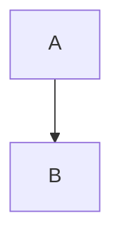

# ローカル開発ガイド

## サービス一覧

| サービス       | ポート | URL                           | 説明             |
| -------------- | ------ | ----------------------------- | ---------------- |
| Blog (Next.js) | 3100   | <http://localhost:3100>       | フロントエンド   |
| Admin UI       | 3100   | <http://localhost:3100/admin> | 記事管理画面     |
| CMS API        | 8787   | <http://localhost:8787>       | バックエンド API |

## クイックスタート

```bash
# 1. セットアップ (初回のみ)
just setup

# 2. 全サービス起動
just dev-all

# 3. ブラウザでアクセス
open http://localhost:3100
```

## コマンド一覧

### 開発サーバー

| コマンド        | 説明                         |
| --------------- | ---------------------------- |
| `just dev-all`  | 全サービス起動               |
| `just dev-blog` | ブログのみ起動               |
| `just dev-api`  | CMS API のみ起動             |

### データベース

| コマンド          | 説明                                     |
| ----------------- | ---------------------------------------- |
| `just db-reset`   | ローカル D1 データベースをリセット       |
| `just db-migrate` | 全マイグレーション実行                   |
| `just db-seed`    | サンプルデータ投入                       |
| `just bootstrap`  | deps + reset + migrate + seed を一括実行 |

### 依存関係

| コマンド    | 説明           |
| ----------- | -------------- |
| `just deps` | pnpm install   |

### ユーティリティ

| コマンド              | 説明                           |
| --------------------- | ------------------------------ |
| `just kill-port 3100` | 指定ポートのプロセスを終了     |

### コード品質

| コマンド      | 説明                      |
| ------------- | ------------------------- |
| `just lint`   | Biome でリント            |
| `just format` | Biome でフォーマット      |
| `just check`  | Biome でチェック          |
| `prek run -a` | 全 pre-commit フック実行  |

### ビルド・テスト

| コマンド      | 説明               |
| ------------- | ------------------ |
| `pnpm build`  | 全パッケージビルド |
| `just e2e`    | E2E テスト実行     |
| `just e2e-ui` | E2E テスト (UI)    |

## 環境変数

### Blog (apps/blog)

| 変数名        | 説明       | デフォルト                 |
| ------------- | ---------- | -------------------------- |
| `CMS_API_URL` | API の URL | `http://localhost:8787/v1` |
| `CMS_API_KEY` | API キー   | (なし)                     |

### CMS API (apps/cms-api)

| 変数名                   | 説明             | デフォルト    |
| ------------------------ | ---------------- | ------------- |
| `ENVIRONMENT`            | 環境名           | `development` |
| `API_KEY`                | API 認証キー     | `dev-api-key` |
| `VERCEL_DEPLOY_HOOK_URL` | デプロイフック   | (なし)        |

## 初期データ投入

サンプルデータを CMS に投入:

```bash
# CMS API が起動している状態で
just seed
```

## ローカル R2 (Wrangler)

Wrangler が R2 をローカルでエミュレートします。Docker 不要。

### データ保存場所

```text
apps/cms-api/.wrangler/state/
```

### 画像 URL

ローカル環境での画像 URL:

```text
http://localhost:8787/v1/images/file/{path}
```

## トラブルシューティング

### ポートが使用中

```bash
# 使用中のポートを確認
lsof -i :3100
lsof -i :8787

# プロセスを終了
kill -9 <PID>
```

### D1/R2 データをリセット

```bash
just db-reset
just db-migrate
```

## 記事の投稿・管理

### Admin 画面へのアクセス

1. 開発サーバーを起動

   ```bash
   # ターミナル1
   just dev-api

   # ターミナル2
   just dev-blog
   ```

2. <http://localhost:3100/admin> にアクセス

3. ログイン（開発環境）

### 新規記事の作成

1. Admin 画面で **New Article** をクリック
2. 以下のフィールドを入力:

   | フィールド   | 説明                                       |
   | ------------ | ------------------------------------------ |
   | Title        | 記事タイトル                               |
   | Slug         | URL 用のスラッグ（タイトルから自動生成可） |
   | Description  | SEO 用の説明文（100-160文字推奨）          |
   | Tags         | タグを選択または新規追加                   |
   | Header Image | ヘッダー画像をアップロード（任意）         |
   | Content      | Markdown 形式で本文を記述                  |

3. **Save** をクリックして下書き保存

### 記事の公開

1. Status バッジ（Draft/Published）をクリックして切り替え
2. **Save** をクリック

または、記事一覧から Publish/Unpublish ボタンで切り替えも可能です。

### 記事の確認

公開された記事は以下の URL で確認:

```text
http://localhost:3100/article/{slug}
```

### Admin 画面 URL 一覧

| URL                                                | 説明           |
| -------------------------------------------------- | -------------- |
| <http://localhost:3100/admin>                      | ダッシュボード |
| <http://localhost:3100/admin/articles>             | 記事一覧       |
| <http://localhost:3100/admin/articles/new>         | 新規作成       |
| <http://localhost:3100/admin/articles/{slug}/edit> | 記事編集       |

### Markdown 記法

Content フィールドでは以下の Markdown 記法が使用可能:

| 記法                      | 説明                 |
| ------------------------- | -------------------- |
| `# 見出し1`               | 見出し（H1〜H6）     |
| `**太字**`                | 太字                 |
| `*斜体*`                  | 斜体                 |
| `~~取り消し~~`            | 取り消し線           |
| `- 項目`                  | 箇条書きリスト       |
| `1. 項目`                 | 番号付きリスト       |
| `> 引用`                  | 引用                 |
| `` `コード` ``            | インラインコード     |
| ``             | 画像                 |
| `[text](url)`             | リンク               |

コードブロック:

````text
```typescript
const x = 1;
```
````

対応言語: `typescript` `javascript` `python` `bash` `json` `yaml` `go` `rust` など。

Mermaid ダイアグラム:

````text

````
