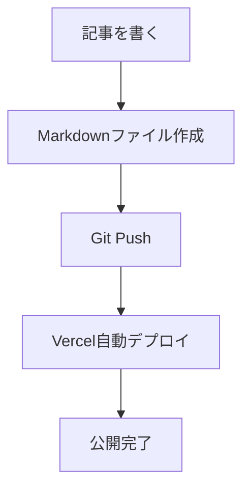
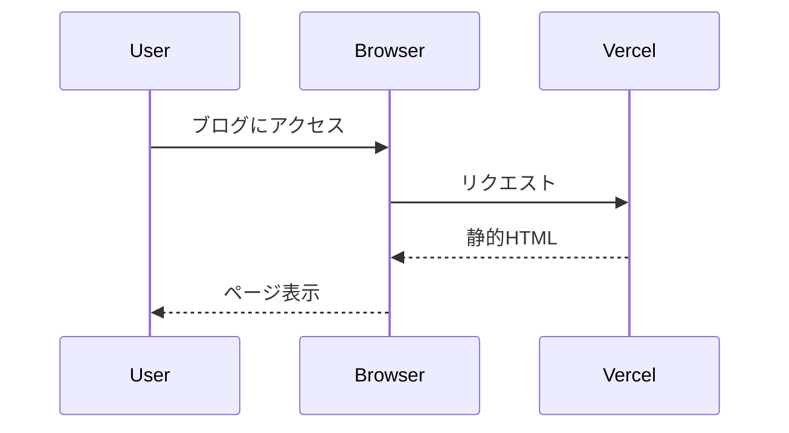

## はじめに

このブログを開設しました。技術的なトピックや日々の学びを共有していきます。

## 技術スタック

このブログは以下の技術で構築されています：

- **Next.js 14** - React フレームワーク
- **Tailwind CSS** - スタイリング
- **Markdown** - コンテンツ管理
- **Vercel** - ホスティング

## コードスニペットのテスト

### TypeScript

```typescript:example.ts
interface Article {
  title: string;
  date: string;
  tags: string[];
}

function getLatestArticles(articles: Article[]): Article[] {
  return articles
    .sort((a, b) => (a.date > b.date ? -1 : 1))
    .slice(0, 5);
}
```

### Python

```python:fibonacci.py
def fibonacci(n: int) -> list[int]:
    """Generate Fibonacci sequence up to n terms."""
    if n <= 0:
        return []
    elif n == 1:
        return [0]

    sequence = [0, 1]
    while len(sequence) < n:
        sequence.append(sequence[-1] + sequence[-2])
    return sequence

# Usage
print(fibonacci(10))  # [0, 1, 1, 2, 3, 5, 8, 13, 21, 34]
```

### Bash

```bash:deploy.sh
#!/bin/bash
set -euo pipefail

echo "Starting deployment..."

# Build the project
pnpm build

# Run tests
pnpm test

# Deploy to production
if [ "$ENVIRONMENT" = "production" ]; then
    echo "Deploying to production..."
    vercel --prod
else
    echo "Deploying to preview..."
    vercel
fi

echo "Deployment complete!"
```

### JSON

```json:package.json
{
  "name": "my-blog",
  "version": "1.0.0",
  "scripts": {
    "dev": "next dev",
    "build": "next build",
    "start": "next start"
  },
  "dependencies": {
    "next": "^14.0.0",
    "react": "^18.0.0"
  }
}
```

### インラインコード

変数名は `camelCase` で、定数は `UPPER_SNAKE_CASE` で命名します。
`npm install` でパッケージをインストールできます。

## Mermaid図表のテスト

フローチャートの例：



シーケンス図の例：



## まとめ

今後も継続的に記事を更新していく予定です。
