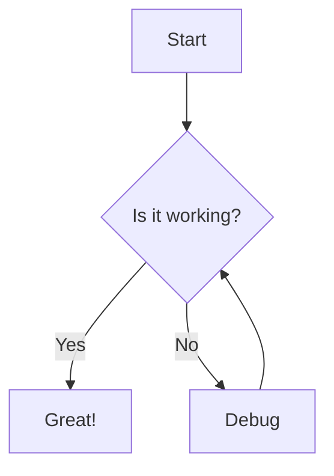

# Code Blocks

This guide explains how to use code blocks in your blog articles.

## Basic Syntax

Wrap your code with triple backticks (` ``` `):

````markdown
```
const hello = "world";
```
````

## Language Specification

Specify the language after the opening backticks for syntax highlighting:

````markdown
```typescript
const message: string = "Hello, TypeScript!";
```
````

### Supported Languages

The following languages are supported for syntax highlighting:

| Language | Identifier |
|----------|------------|
| TypeScript | `typescript`, `ts` |
| JavaScript | `javascript`, `js` |
| TSX | `tsx` |
| JSX | `jsx` |
| Python | `python`, `py` |
| Bash | `bash`, `shellscript` |
| JSON | `json` |
| YAML | `yaml` |
| Markdown | `markdown`, `md` |
| HTML | `html` |
| CSS | `css` |
| SQL | `sql` |
| Go | `go` |
| Rust | `rust` |
| Java | `java` |
| C | `c` |
| C++ | `cpp` |

## Filename Display

Add a filename after the language with a colon to display it in the header:

````markdown
```typescript:src/utils/hello.ts
export function hello(name: string): string {
  return `Hello, ${name}!`;
}
```
````

This displays "src/utils/hello.ts" in the code block header.

## Line Numbers

Line numbers are automatically displayed for all code blocks. No additional configuration is needed.

## Copy Button

All code blocks include a copy button in the header. Click it to copy the code to your clipboard.

## Fullscreen Mode

Click the expand icon in the code block header to view code in fullscreen mode. This is useful for long code snippets.

## Special Code Blocks

In addition to standard code blocks, the blog supports several special block types:

### Mermaid Diagrams

Create diagrams using Mermaid syntax:

````markdown

````

### Code Diff

Show code differences:

````markdown
```diff
- const old = "removed";
+ const new = "added";
```
````

### File Tree

Display directory structures:

````markdown
```tree
src/
  components/
    Button.tsx
    Input.tsx
  utils/
    helpers.ts
```
````

### Terminal Animation

Show terminal output with typing animation:

````markdown
```terminal
$ npm install
$ npm run build
Building...
Done!
```
````

### Charts

Create interactive charts:

````markdown
```chart
type: bar
data:
  labels: [Jan, Feb, Mar]
  values: [10, 20, 30]
```
````

### Image Carousel

Display multiple images in a carousel:

````markdown
```carousel
/images/photo1.jpg
/images/photo2.jpg
/images/photo3.jpg
```
````

### Image Comparison

Create before/after image comparisons:

````markdown
```compare
before: /images/before.jpg
after: /images/after.jpg
```
````

### 3D Model Viewer

Display 3D models:

````markdown
```model
/models/example.glb
```
````
