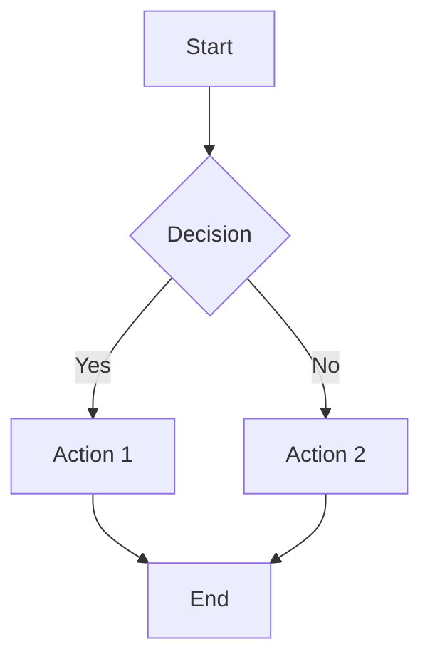
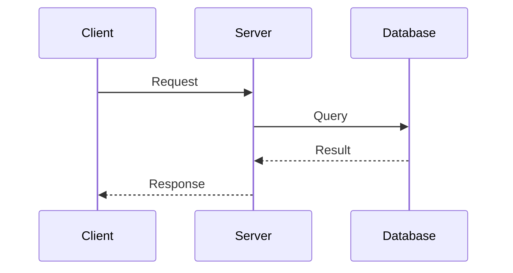
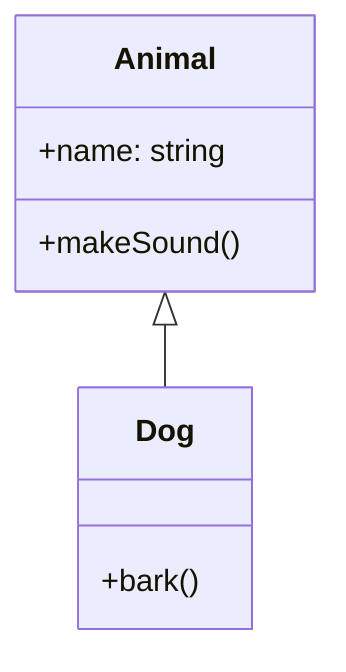
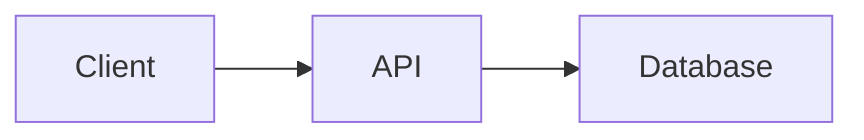

# Special Components

This guide covers the special components available in blog articles beyond standard Markdown.

## Mermaid Diagrams

Create flowcharts, sequence diagrams, and more using Mermaid syntax.

### Flowchart

````markdown

````

### Sequence Diagram

````markdown

````

### Class Diagram

````markdown

````

## Charts

Create interactive charts with a simple YAML syntax.

### Bar Chart

````markdown
```chart
type: bar
data:
  labels: [Jan, Feb, Mar, Apr]
  values: [10, 25, 15, 30]
```
````

### Line Chart

````markdown
```chart
type: line
data:
  labels: [Q1, Q2, Q3, Q4]
  values: [100, 150, 120, 200]
```
````

### Pie Chart

````markdown
```chart
type: pie
data:
  labels: [TypeScript, JavaScript, Python]
  values: [60, 25, 15]
```
````

## Terminal Animation

Display terminal output with typing animation effect.

````markdown
```terminal
$ npm create hono@latest my-app
? Which template do you want to use? cloudflare-workers
✓ Cloning the template...
$ cd my-app
$ npm install
added 50 packages in 3s
$ npm run dev
Server running at http://localhost:8787
```
````

Lines starting with `$` are typed character by character. Other lines appear instantly.

## File Tree

Display directory structures clearly.

````markdown
```tree
src/
  components/
    Button.tsx
    Input.tsx
    Modal/
      Modal.tsx
      Modal.css
  pages/
    index.tsx
    about.tsx
  utils/
    helpers.ts
package.json
tsconfig.json
```
````

Use 2-space indentation to indicate nesting levels.

## Image Carousel

Display multiple images in a carousel/slider.

````markdown
```carousel
/images/screenshot-1.png
/images/screenshot-2.png
/images/screenshot-3.png
/images/screenshot-4.png
```
````

Users can navigate between images using arrows or swipe gestures.

## Image Compare (Before/After)

Create interactive before/after comparisons with a slider.

````markdown
```compare
before: /images/original.jpg
after: /images/edited.jpg
```
````

Users can drag the slider to compare the two images.

## Code Diff

Show code changes with additions and deletions highlighted.

````markdown
```diff
- const oldFunction = () => {
-   return "old";
- };
+ const newFunction = () => {
+   return "new";
+ };
```
````

Lines starting with `-` are shown as removed (red). Lines starting with `+` are shown as added (green).

## 3D Model Viewer

Display interactive 3D models.

````markdown
```model
/models/example.glb
```
````

### Supported Formats

- GLB (recommended)
- GLTF

Users can rotate and zoom the model using mouse or touch gestures.

## Usage Tips

1. **Keep diagrams simple** - Complex diagrams become hard to read
2. **Use appropriate chart types** - Bar for comparisons, line for trends, pie for parts of a whole
3. **Limit carousel images** - 3-5 images works best
4. **Optimize 3D models** - Large models affect page load time

## Combining Components

Components can be used alongside regular Markdown:

````markdown
## Architecture Overview

Here's how our system works:



The data flow is straightforward, as shown above.
````
