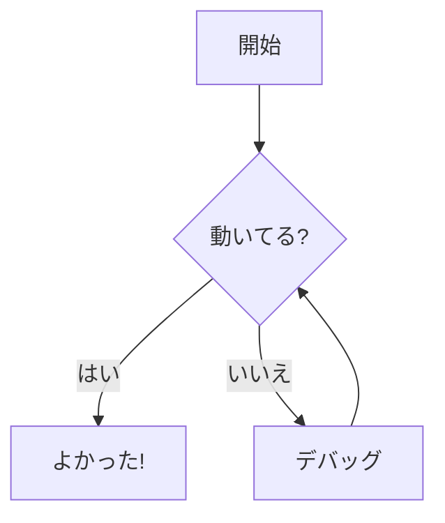

# コードブロック

このガイドでは、ブログ記事でコードブロックを使用する方法を説明します。

## 基本構文

コードをトリプルバッククォート (` ``` `) で囲みます：

````markdown
```
const hello = "world";
```
````

## 言語指定

シンタックスハイライトを有効にするには、開始バッククォートの後に言語を指定します：

````markdown
```typescript
const message: string = "Hello, TypeScript!";
```
````

### 対応言語

以下の言語のシンタックスハイライトに対応しています：

| 言語 | 識別子 |
|------|--------|
| TypeScript | `typescript`, `ts` |
| JavaScript | `javascript`, `js` |
| TSX | `tsx` |
| JSX | `jsx` |
| Python | `python`, `py` |
| Bash | `bash`, `shellscript` |
| JSON | `json` |
| YAML | `yaml` |
| Markdown | `markdown`, `md` |
| HTML | `html` |
| CSS | `css` |
| SQL | `sql` |
| Go | `go` |
| Rust | `rust` |
| Java | `java` |
| C | `c` |
| C++ | `cpp` |

## ファイル名表示

言語の後にコロンとファイル名を追加すると、ヘッダーにファイル名が表示されます：

````markdown
```typescript:src/utils/hello.ts
export function hello(name: string): string {
  return `Hello, ${name}!`;
}
```
````

これにより、コードブロックのヘッダーに「src/utils/hello.ts」が表示されます。

## 行番号

すべてのコードブロックに行番号が自動的に表示されます。追加の設定は不要です。

## コピーボタン

すべてのコードブロックのヘッダーにコピーボタンがあります。クリックするとコードがクリップボードにコピーされます。

## フルスクリーンモード

コードブロックのヘッダーにある展開アイコンをクリックすると、フルスクリーンモードでコードを表示できます。長いコードを見るときに便利です。

## 特殊コードブロック

標準のコードブロックに加えて、いくつかの特殊なブロックタイプをサポートしています：

### Mermaid ダイアグラム

Mermaid 構文でダイアグラムを作成：

````markdown

````

### コード差分

コードの差分を表示：

````markdown
```diff
- const old = "削除された行";
+ const new = "追加された行";
```
````

### ファイルツリー

ディレクトリ構造を表示：

````markdown
```tree
src/
  components/
    Button.tsx
    Input.tsx
  utils/
    helpers.ts
```
````

### ターミナルアニメーション

タイピングアニメーション付きでターミナル出力を表示：

````markdown
```terminal
$ npm install
$ npm run build
ビルド中...
完了!
```
````

### チャート

インタラクティブなチャートを作成：

````markdown
```chart
type: bar
data:
  labels: [1月, 2月, 3月]
  values: [10, 20, 30]
```
````

### 画像カルーセル

複数の画像をカルーセルで表示：

````markdown
```carousel
/images/photo1.jpg
/images/photo2.jpg
/images/photo3.jpg
```
````

### 画像比較

Before/After の画像比較を作成：

````markdown
```compare
before: /images/before.jpg
after: /images/after.jpg
```
````

### 3D モデルビューア

3D モデルを表示：

````markdown
```model
/models/example.glb
```
````
