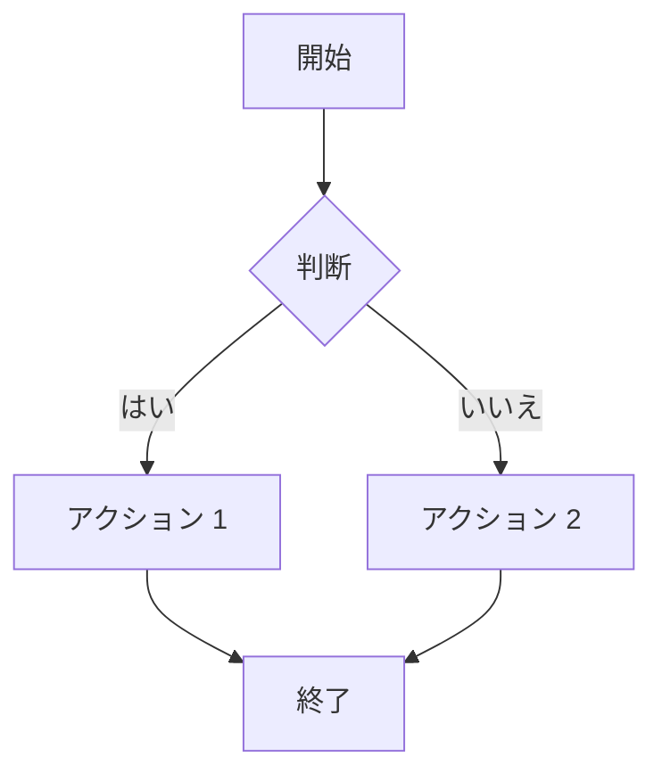
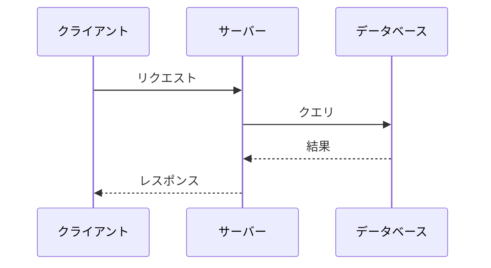
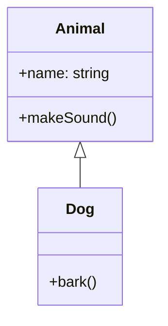
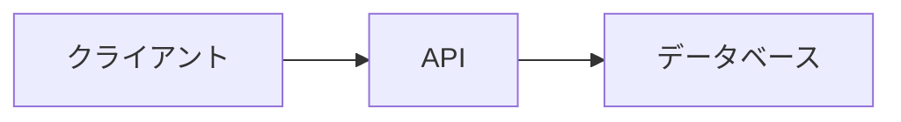

# 特殊コンポーネント

このガイドでは、ブログ記事で使用できる特殊コンポーネントを説明します。

## Mermaid ダイアグラム

Mermaid 構文を使用してフローチャート、シーケンス図などを作成できます。

### フローチャート

````markdown

````

### シーケンス図

````markdown

````

### クラス図

````markdown

````

## チャート

シンプルな YAML 構文でインタラクティブなチャートを作成できます。

### 棒グラフ

````markdown
```chart
type: bar
data:
  labels: [1月, 2月, 3月, 4月]
  values: [10, 25, 15, 30]
```
````

### 折れ線グラフ

````markdown
```chart
type: line
data:
  labels: [Q1, Q2, Q3, Q4]
  values: [100, 150, 120, 200]
```
````

### 円グラフ

````markdown
```chart
type: pie
data:
  labels: [TypeScript, JavaScript, Python]
  values: [60, 25, 15]
```
````

## ターミナルアニメーション

タイピングアニメーション効果付きでターミナル出力を表示します。

````markdown
```terminal
$ npm create hono@latest my-app
? Which template do you want to use? cloudflare-workers
✓ Cloning the template...
$ cd my-app
$ npm install
added 50 packages in 3s
$ npm run dev
Server running at http://localhost:8787
```
````

`$` で始まる行は1文字ずつタイプされます。他の行は即座に表示されます。

## ファイルツリー

ディレクトリ構造を明確に表示します。

````markdown
```tree
src/
  components/
    Button.tsx
    Input.tsx
    Modal/
      Modal.tsx
      Modal.css
  pages/
    index.tsx
    about.tsx
  utils/
    helpers.ts
package.json
tsconfig.json
```
````

ネストレベルを示すために 2 スペースのインデントを使用します。

## 画像カルーセル

複数の画像をカルーセル/スライダーで表示します。

````markdown
```carousel
/images/screenshot-1.png
/images/screenshot-2.png
/images/screenshot-3.png
/images/screenshot-4.png
```
````

ユーザーは矢印またはスワイプジェスチャーで画像間を移動できます。

## 画像比較（Before/After）

スライダー付きのインタラクティブな Before/After 比較を作成します。

````markdown
```compare
before: /images/original.jpg
after: /images/edited.jpg
```
````

ユーザーはスライダーをドラッグして2つの画像を比較できます。

## コード差分

追加と削除をハイライト表示してコード変更を表示します。

````markdown
```diff
- const oldFunction = () => {
-   return "old";
- };
+ const newFunction = () => {
+   return "new";
+ };
```
````

`-` で始まる行は削除（赤）として表示されます。`+` で始まる行は追加（緑）として表示されます。

## 3D モデルビューア

インタラクティブな 3D モデルを表示します。

````markdown
```model
/models/example.glb
```
````

### 対応フォーマット

- GLB（推奨）
- GLTF

ユーザーはマウスまたはタッチジェスチャーでモデルを回転・ズームできます。

## 使用上のヒント

1. **ダイアグラムはシンプルに** - 複雑なダイアグラムは読みづらい
2. **適切なチャートタイプを使用** - 比較には棒グラフ、トレンドには折れ線、全体の一部には円グラフ
3. **カルーセルの画像数を制限** - 3〜5 枚が最適
4. **3D モデルを最適化** - 大きなモデルはページ読み込みに影響

## コンポーネントの組み合わせ

コンポーネントは通常の Markdown と一緒に使用できます：

````markdown
## アーキテクチャ概要

システムの仕組みは以下の通りです：



上に示すように、データフローはシンプルです。
````
