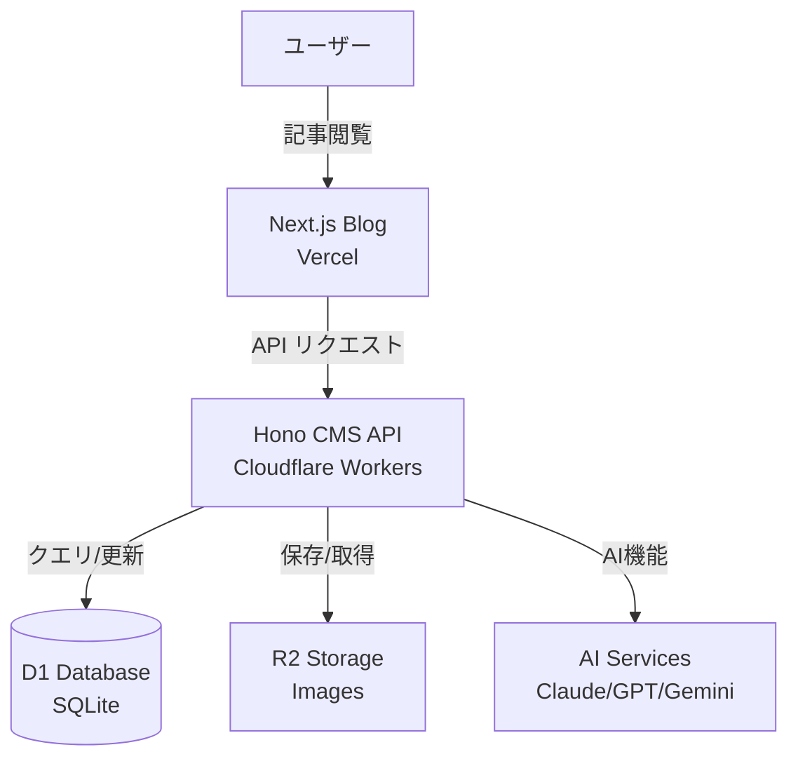
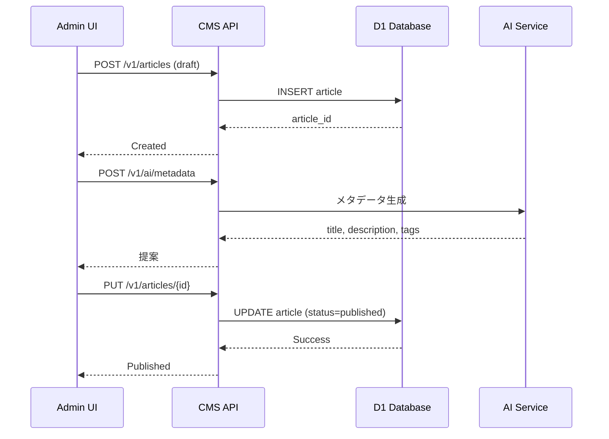
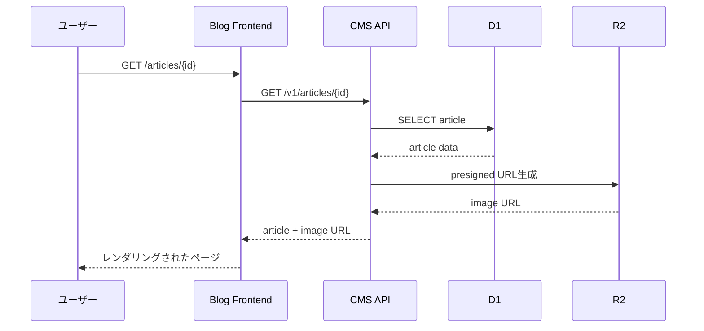
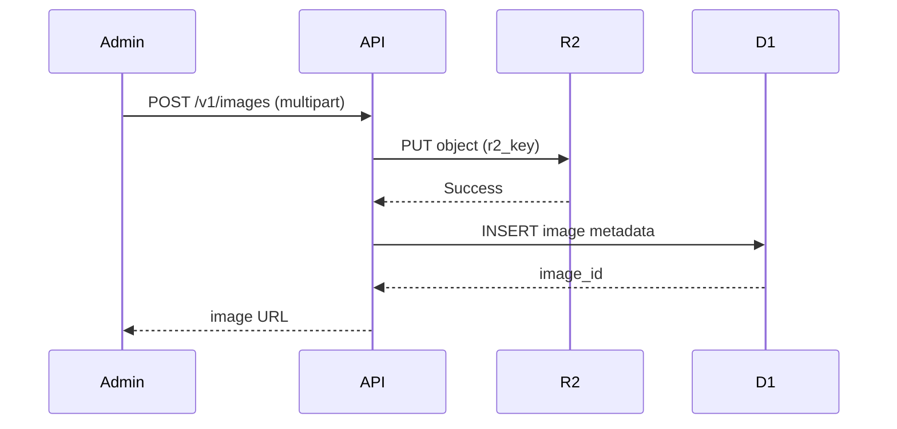
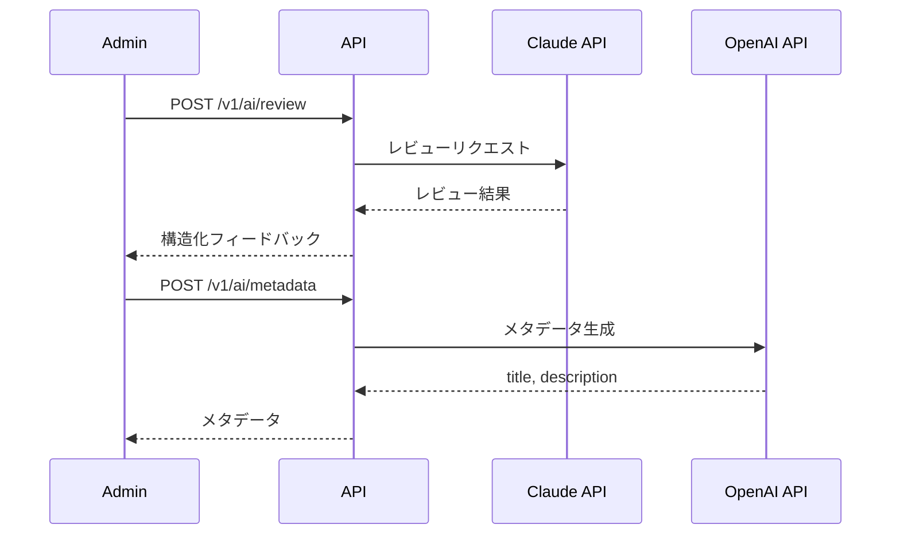
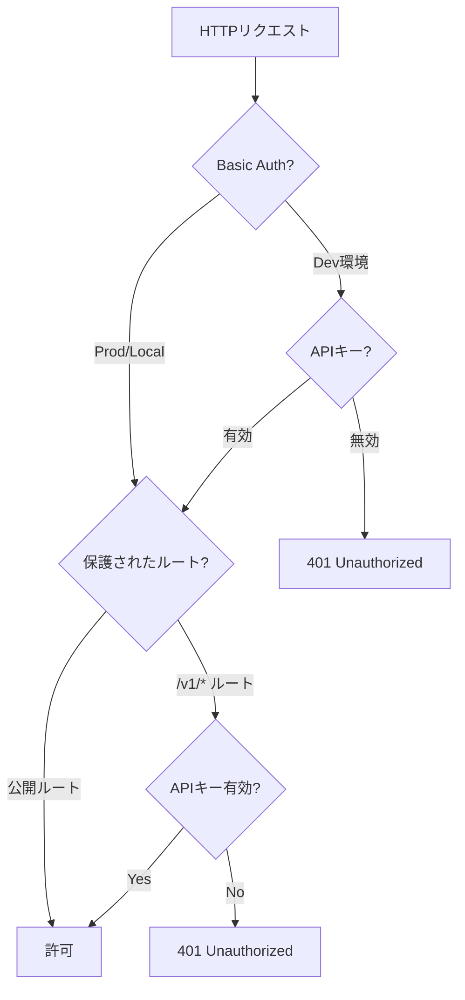
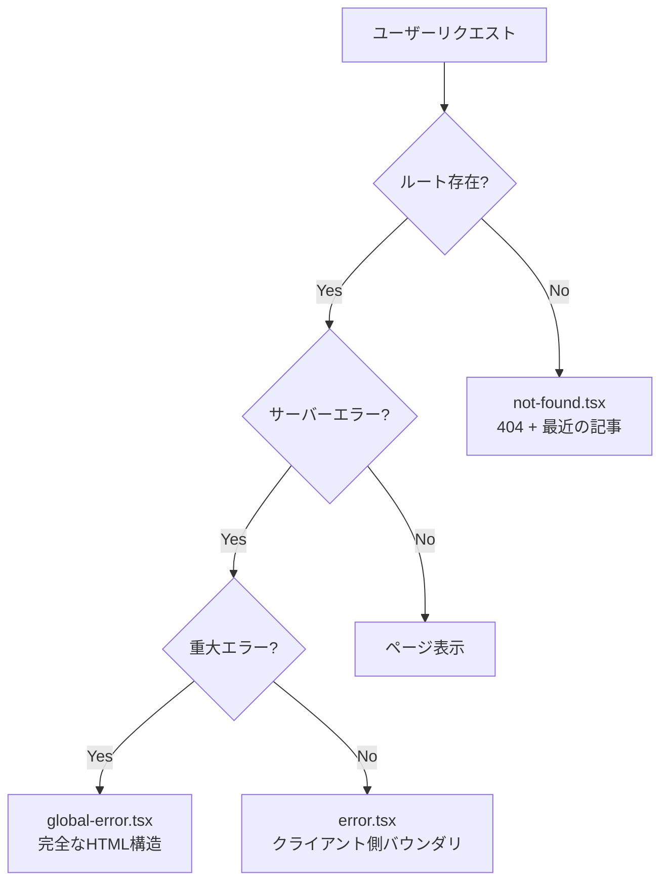
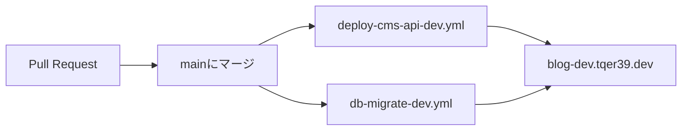
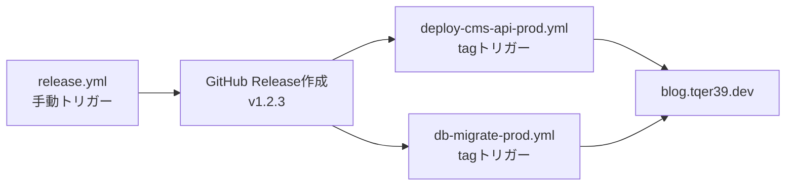
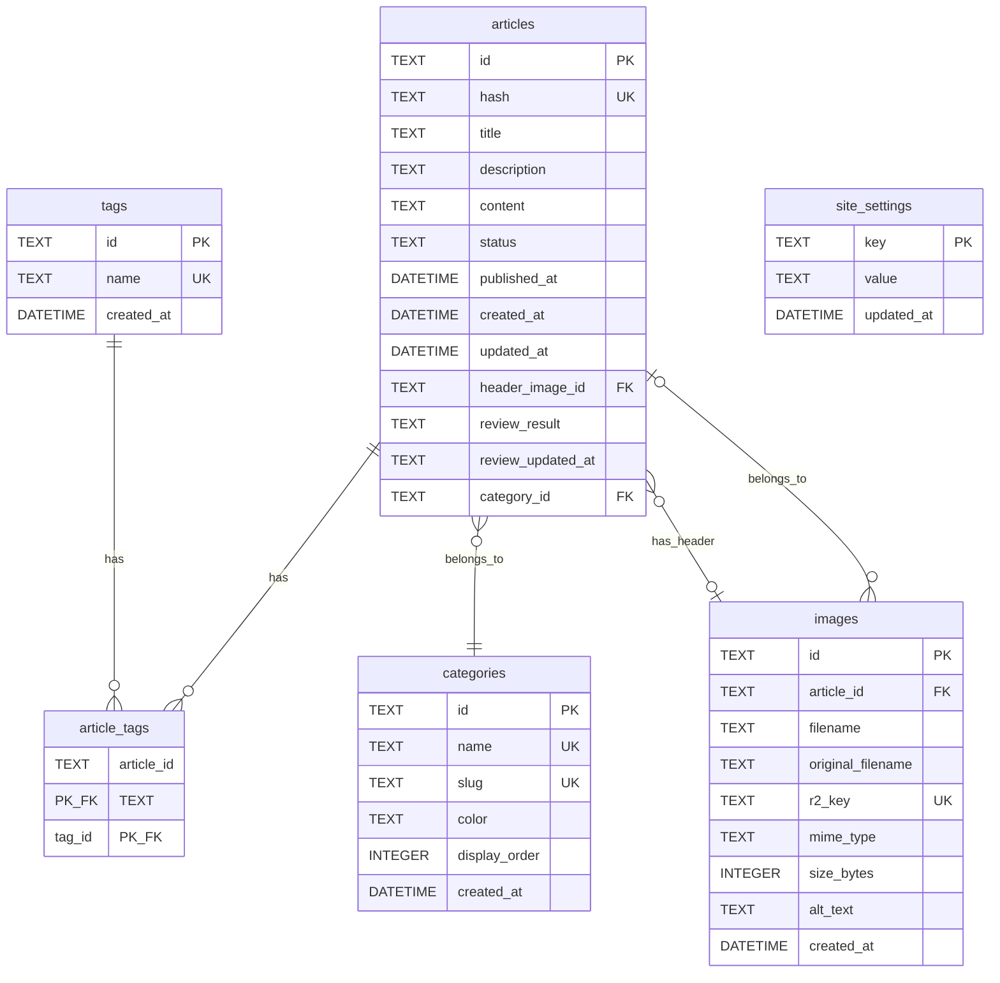

# アーキテクチャガイド

[🇺🇸 English](ARCHITECTURE.md)

> **目的**: システム設計決定、トレードオフ、コンテキストの記録
> **対象読者**: 未来の自分(6ヶ月以上後)、新規貢献者
> **最終更新**: 2026-01-14

## 目次

1. [システム概要](#システム概要)
2. [アーキテクチャ原則](#アーキテクチャ原則)
3. [システムコンポーネント](#システムコンポーネント)
4. [データフローと相互作用](#データフローと相互作用)
5. [認証とセキュリティ](#認証とセキュリティ)
6. [エラーハンドリング戦略](#エラーハンドリング戦略)
7. [デプロイアーキテクチャ](#デプロイアーキテクチャ)
8. [データベーススキーマ](#データベーススキーマ)
9. [API構造](#api構造)
10. [主要な設計パターン](#主要な設計パターン)
11. [パフォーマンス考慮事項](#パフォーマンス考慮事項)
12. [開発ワークフロー](#開発ワークフロー)
13. [関連ドキュメント](#関連ドキュメント)

---

## システム概要

サーバーレスファーストアプローチで構築された個人ブログサービス。最小限のメンテナンスと最大のパフォーマンスを実現します。Vercel上のNext.jsブログフロントエンドと、Cloudflare Workers上のHonoベースCMS API、AI支援によるコンテンツ作成で構成されています。

**コア哲学**: ミニマル、高速、AI支援付き個人ブログ。



### なぜこのアーキテクチャ?

- **サーバーレスファースト**: サーバーメンテナンス不要、自動スケーリング
- **Next.js 15**: App RouterによるServer Componentsでの最適パフォーマンス
- **Hono on Workers**: グローバル配信による超高速エッジコンピュート
- **Cloudflareスタック**: D1 (SQLite) + R2 (オブジェクトストレージ) でサーバーレスなデータベースとストレージ
- **AI統合**: コンテンツレビュー用Claude、メタデータ用GPT、画像用Gemini

---

## アーキテクチャ原則

### 1. Monorepo構造 (Turborepo + pnpm)

**決定**: MonorepoでブログフロントエンドとCMS APIのコードを共有

**理由**:
- `@blog/cms-types`による型安全性(フロントエンド/バックエンド間)
- `@blog/ui`で再利用可能なUIコンポーネント
- `@blog/config`で集中管理された設定
- pnpm workspacesによる単一の依存関係管理

**トレードオフ**:
- ✅ サービス間のリファクタリングが容易
- ✅ ツールと依存関係の一貫性
- ⚠️ 初期セットアップがやや複雑

### 2. ULIDベースの永続URL

**決定**: 記事IDにULIDを使用し、永続URL (`/articles/{ULID}`)を形成

**理由**:
- タイトル/カテゴリが変更されてもURLは変わらない
- データベースクエリなしで時間順ソート可能
- スラッグの衝突なし

**トレードオフ**:
- ✅ 永続リンク(SEOフレンドリー)
- ✅ スラッグ管理のオーバーヘッドなし
- ⚠️ URLの可読性は低い(個人ブログでは重要でない)

### 3. Workers上のサーバーレスバックエンド

**決定**: 従来のサーバーではなくCloudflare Workers上でCMS APIを実行

**理由**:
- グローバルエッジ配信(世界中で低レイテンシ)
- サーバーメンテナンス不要
- リクエストごとの従量課金(個人ブログにコスト効率的)

**制限事項**:
- Node.js標準ライブラリなし(HonoがほとんどのAPI操作を抽象化)
- リクエストあたり10msのCPU時間制限(API操作には十分)

### 4. packages/configの静的メタデータ

**決定**: 環境定数と設定を集中管理

**理由**:
- ポート、ドメイン、CORS originの信頼できる唯一の情報源
- サービス間で共有される型安全な設定
- 環境切り替えが容易

### 5. ユーザーフレンドリーなエラーページ哲学

**決定**: エラーページ(404、エラーバウンダリ)は技術的詳細よりユーザー体験を優先

**最近の実装 (2026-01-14)**:
- 404ページは最近の記事3件を表示し、ユーザーがコンテンツを見つけられるようにする
- エラーバウンダリは「再試行」と「ホームに戻る」アクションを提供
- グローバルエラーハンドラはルートレイアウトエラーをキャッチ

**理由**:
- 迷ったユーザーは価値あるコンテンツにリダイレクトされるべき
- グレースフルデグラデーション(404はAPIが成功した場合のみ記事を表示)
- 一貫した「Notepad + Index」ミニマリストデザイン

### 6. 「Notepad + Index」UIデザイン

**決定**: 可読性重視のミニマリストデザイン

**原則**:
- 派手なアニメーションや装飾なし
- コンテンツファーストレイアウト
- コードブロックは折りたたみ可能(スキャン性向上)
- Tailwind CSSとtypographyプラグインでプロースコンテンツ

---

## システムコンポーネント

### フロントエンド (apps/blog)

**技術**: Next.js 15 with App Router、React Server Components

#### App Router構造

```text
app/
├── (public)/
│   ├── page.tsx              # ホームページ(最新5記事)
│   ├── articles/
│   │   ├── page.tsx          # 記事一覧
│   │   └── [id]/page.tsx     # 記事詳細
│   ├── about/page.tsx        # Aboutページ
│   └── layout.tsx            # 公開レイアウト(ヘッダー、フッター)
├── admin/
│   ├── login/page.tsx        # 管理者ログイン
│   ├── articles/
│   │   ├── page.tsx          # 管理者記事一覧
│   │   └── [id]/page.tsx     # 管理者エディタ
│   └── layout.tsx            # 管理者レイアウト(保護)
├── error.tsx                 # クライアントサイドエラーバウンダリ
├── global-error.tsx          # グローバルエラーハンドラ
├── not-found.tsx             # 404ページ(最近の記事付き)
└── layout.tsx                # ルートレイアウト
```

#### ServerコンポーネントとClientコンポーネントの戦略

- **Serverコンポーネント(デフォルト)**: 記事ページ、ホームページ、レイアウト
- **Clientコンポーネント**: 管理者エディタ、インタラクティブUI(モーダル、フォーム)
- **メリット**: 小さいJSバンドル、速い初期ページロード

#### コンポーネント階層

```text
components/
├── ArticleCard.tsx           # 記事プレビューカード
├── CategoryBadge.tsx         # カテゴリタグ
├── JsonLd.tsx               # SEO用構造化データ
├── MarkdownRenderer.tsx      # 記事コンテンツレンダラー
├── Header.tsx               # サイトヘッダー
└── Footer.tsx               # サイトフッター
```

#### エラーバウンダリ

**実装日 2026-01-14**:

1. **not-found.tsx** (404ページ)
   - 「ページが見つかりません」メッセージ表示
   - 最近の記事3件を表示(APIが成功した場合)
   - ホームページと記事一覧へのリンク
   - SEO: `noindex, nofollow`

2. **error.tsx** (クライアントサイドエラーバウンダリ)
   - ページコンポーネントのランタイムエラーをキャッチ
   - エラー状態をリセットする「再試行」ボタン
   - 開発モードでエラーをログ出力
   - ホームページへのリンク

3. **global-error.tsx** (グローバルエラーハンドラ)
   - ルートレイアウトのエラーをキャッチ
   - 完全なHTML構造をレンダリング(`<html>`、`<body>`)
   - ダークモード対応
   - 最後の砦のエラーページ

### バックエンド (apps/cms-api)

**技術**: Hono on Cloudflare Workers

#### アプリケーション構造

```text
src/
├── index.ts                  # エントリポイント、ミドルウェアスタック
├── handlers/
│   ├── articles.ts          # 記事CRUD
│   ├── ai.ts                # AI機能
│   ├── images.ts            # 画像アップロード/削除
│   ├── categories.ts        # カテゴリ管理
│   ├── tags.ts              # タグ管理
│   ├── settings.ts          # サイト設定
│   └── webhook.ts           # 外部Webhook
├── middleware/
│   ├── basicAuth.ts         # 開発環境保護
│   ├── auth.ts              # APIキー検証
│   ├── rateLimit.ts         # レート制限
│   └── cors.ts              # CORS設定
└── lib/
    └── exceptions.ts         # ApiExceptionクラス
```

#### ミドルウェアスタック

```typescript
// index.ts
app.use('*', logger());
app.use('*', basicAuth);      // Dev only
app.use('*', rateLimit);      // All environments
app.use('*', corsMiddleware); // CORS headers
```

#### ハンドラー構成

- **公開エンドポイント**: `/health`、`/v1/settings`、`/v1/images/file/*` (dev only)
- **認証付きエンドポイント**: `/v1/*` (APIキー必須)

#### エラーハンドリング

- **ApiException**: code、message、detailsを持つ構造化エラーレスポンス
- **グローバルエラーハンドラ**: 予期しないエラーをキャッチし、本番環境では詳細を隠す

```typescript
// エラーレスポンス形式
{
  "error": {
    "code": "NOT_FOUND",
    "message": "Article not found",
    "details": { ... } // オプション
  }
}
```

### データレイヤー

#### D1データベース (SQLite)

**マイグレーション**:
- `001_init.sql`: 初期スキーマ(articles、tags、images、site_settings)
- `002_categories.sql`: カテゴリサポート

**主要機能**:
- トリガーによる自動タイムスタンプ更新
- データ整合性のための外部キー制約
- パフォーマンスのためのインデックス

#### R2オブジェクトストレージ

**目的**: 記事ヘッダー画像とインライン画像の保存

**戦略**:
- CMS API経由で画像をアップロード
- D1の`images`テーブルにメタデータを保存
- presigned URL(1時間有効期限)またはCDN経由で配信

**URL優先順位**:
1. Presigned URL(プライベートバケット)
2. `R2_PUBLIC_URL`(パブリックバケット)
3. ローカル開発エンドポイント(`/v1/images/file/*`)
4. CDN URL(`cdn.tqer39.dev`)

### AI統合

**ユースケース別モデル**:

| モデル         | プロバイダー | ユースケース                    | 理由                   |
| -------------- | ------------ | ------------------------------- | ---------------------- |
| Claude Sonnet  | Anthropic    | レビュー、アウトライン、変換等  | 最高の推論品質         |
| GPT-4o-mini    | OpenAI       | メタデータ生成                  | 高速、コスト効率的     |
| Gemini         | Google       | ヘッダー画像生成                | 優れた画像理解         |

**機能**:
- **レビュー**: 記事構造を分析し、改善を提案
- **アウトライン**: トピックから記事アウトラインを生成
- **メタデータ**: タイトル、説明、タグを自動生成
- **変換**: 異なるスタイルでコンテンツを書き直し
- **継続**: 次の段落を提案
- **画像**: プロンプトからヘッダー画像を生成

詳細は[AI-INTEGRATION.md](AI-INTEGRATION.md)を参照。

---

## データフローと相互作用

### 1. 記事作成フロー



### 2. 記事表示フロー



### 3. 画像アップロードフロー



### 4. AI支援フロー



---

## 認証とセキュリティ

### 3層認証



### 1. Basic Auth (Dev環境のみ)

**目的**: 開発環境への不正アクセスを防止

**環境**: `ENVIRONMENT=dev`

**認証情報**:
- ユーザー名: `BASIC_AUTH_USER`
- パスワード: `BASIC_AUTH_PASSWORD`

**保護対象**: 開発環境のすべてのCMS APIエンドポイント

### 2. APIキー (CMS API)

**目的**: CMS APIへのリクエストを認証

**ヘッダー**: `x-api-key: {API_KEY}`

**保護対象**: 公開エンドポイントを除くすべての`/v1/*`ルート

**公開エンドポイント**(APIキー不要):
- `GET /health`
- `GET /v1/settings`
- `GET /v1/images/file/*` (ローカル開発のみ)

### 3. パスワード (Admin UI)

**目的**: 管理者ダッシュボードを保護

**環境変数**: `ADMIN_PASSWORD`

**フロー**:
1. 管理者が`/admin`に移動
2. `/admin/login`にリダイレクト
3. パスワードを送信
4. ブラウザにセッションを保存

---

## エラーハンドリング戦略

### HTTPエラーページ (実装日 2026-01-14)



#### not-found.tsx (404ページ)

**機能**:
- 説明付きの「ページが見つかりません」メッセージ
- ホームページと記事一覧へのリンク
- 最近の記事3件を表示(APIが成功した場合)
- グレースフルデグラデーション: APIが失敗した場合は記事セクションを非表示

**SEO**: `noindex, nofollow`

**コードパターン**:
```typescript
export default async function NotFound() {
  const result = await getAllArticles();
  const recentArticles = result.ok ? result.data.slice(0, 3) : [];
  // recentArticles.lengthに基づく条件付きレンダリング
}
```

#### error.tsx (クライアントサイドエラーバウンダリ)

**機能**:
- ページコンポーネントのランタイムエラーをキャッチ
- コンソールにエラーをログ出力(開発モード)
- エラー状態をリセットする「再試行」ボタン
- 「ホームに戻る」リンク

**要件**: Clientコンポーネントでなければならない(`'use client'`)

#### global-error.tsx (グローバルエラーハンドラ)

**機能**:
- ルートレイアウトのエラーをキャッチ
- 完全なHTML構造をレンダリング(`<html>`と`<body>`を含む)
- `suppressHydrationWarning`によるダークモード対応
- 可能な限りシンプルなエラーページ(依存関係なし)

**トリガー**: ルートレイアウトエラー、重大な障害

### APIエラーハンドリング

**ApiExceptionクラス**(構造化エラー):
```typescript
throw new ApiException(404, 'NOT_FOUND', 'Article not found', { id });
```

**エラーレスポンス形式**:
```json
{
  "error": {
    "code": "NOT_FOUND",
    "message": "Article not found",
    "details": { "id": "01HXQ..." }
  }
}
```

**本番環境でのエラー隠蔽**:
- 詳細なエラーメッセージはdev/localのみ
- 本番環境では汎用的な「予期しないエラーが発生しました」

---

## デプロイアーキテクチャ

### 3環境構成

```text
┌─────────────────┬─────────────────────────┬───────────────────────────────┐
│      Local      │           Dev           │             Prod              │
├─────────────────┼─────────────────────────┼───────────────────────────────┤
│ Blog:           │ Blog:                   │ Blog:                         │
│ localhost:3100  │ blog-dev.tqer39.dev     │ blog.tqer39.dev               │
├─────────────────┼─────────────────────────┼───────────────────────────────┤
│ CMS API:        │ CMS API:                │ CMS API:                      │
│ localhost:3101  │ cms-api-dev.tqer39      │ cms-api.tqer39.workers.dev    │
│                 │ .workers.dev            │                               │
├─────────────────┼─────────────────────────┼───────────────────────────────┤
│ CDN/R2:         │ CDN/R2:                 │ CDN/R2:                       │
│ localhost:3102  │ cdn.tqer39.dev          │ cdn.tqer39.dev                │
├─────────────────┼─────────────────────────┼───────────────────────────────┤
│ D1: local       │ blog-cms-dev            │ blog-cms-prod                 │
│ R2: local       │ blog-assets-dev         │ blog-assets-prod              │
├─────────────────┼─────────────────────────┼───────────────────────────────┤
│ No Auth         │ Basic Auth + API Key    │ No Auth (public) + API Key    │
└─────────────────┴─────────────────────────┴───────────────────────────────┘
```

### CI/CDフロー

#### 開発環境デプロイ (自動)



**トリガー**:
- `main`ブランチへのプッシュ
- `cms-api-dev`にCMS APIをデプロイ
- `blog-cms-dev` D1データベースでマイグレーション実行

#### 本番環境デプロイ (手動)



**ステップ**:
1. `release.yml`ワークフローを手動実行
2. セマンティックバージョンタグ(例: `v1.2.3`)でGitHub Releaseを作成
3. タグが本番環境デプロイワークフローをトリガー
4. BlogはVercel経由で自動デプロイ(mainブランチに接続)

### ホスティング

| コンポーネント | プロバイダー        | サービス             |
| -------------- | ------------------- | -------------------- |
| Blog           | Vercel              | Serverless Functions |
| CMS API        | Cloudflare Workers  | エッジコンピュート   |
| Database       | Cloudflare D1       | 分散SQLite           |
| Storage        | Cloudflare R2       | オブジェクトストレージ|
| DNS            | Cloudflare          | DNS + CDN            |

### ドメイン設定

**DNS**: Cloudflare DNS経由で管理

**ドメイン**:
- `blog.tqer39.dev` → Vercel (CNAME)
- `blog-dev.tqer39.dev` → Vercelプレビュー (CNAME)
- `cms-api.tqer39.workers.dev` → Workers (自動)
- `cdn.tqer39.dev` → R2パブリックバケット (CNAME)

---

## データベーススキーマ



### 主要テーブル

#### articles

- **id**: ULID、主キー
- **hash**: 記事コンテンツの一意のハッシュ(URL用)
- **status**: `draft` | `published`
- **header_image_id**: imagesテーブルへのFK(nullable)
- **review_result**: 保存されたAIレビュー結果(JSON文字列)
- **category_id**: categoriesテーブルへのFK(nullable)

**インデックス**:
- `idx_articles_status` on `status`
- `idx_articles_published_at` on `published_at DESC`
- `idx_articles_hash` (unique) on `hash`
- `idx_articles_category` on `category_id`

#### tags & article_tags

**多対多リレーションシップ**をジャンクションテーブル経由で実現

**tags**:
- `id`と`name`のシンプルなテーブル

**article_tags**:
- 複合主キー`(article_id, tag_id)`
- `CASCADE`削除付き外部キー

#### categories

- **display_order**: UI内の表示順序を制御
- **slug**: URLフレンドリーな識別子(例: `tech`、`life`、`books`)
- **color**: カテゴリバッジの16進数カラー

**シードデータ**: Tech (青)、Life (緑)、Books (オレンジ)

#### images

- **r2_key**: R2バケット内の一意のキー(形式: `{ULID}.{ext}`)
- **article_id**: articlesへのオプショナルFK(インライン画像用)
- **header_image_id**: articles.header_image_idから参照(ヘッダー画像用)

#### site_settings

サイト全体の設定用**キーバリューストア**:
- `site_name`、`site_description`
- `author_name`
- `footer_text`
- `social_github`、`social_twitter`、`social_bento`

**自動更新**: 変更時に`updated_at`を更新するトリガー

---

## API構造

### 公開エンドポイント (認証不要)

| Method | Path                 | Description               |
| ------ | -------------------- | ------------------------- |
| GET    | `/health`            | ヘルスチェック            |
| GET    | `/v1/settings`       | 公開サイト設定            |
| GET    | `/v1/images/file/*`  | 画像配信(開発環境のみ)    |

### 認証付きエンドポイント (APIキー必須: `x-api-key`ヘッダー)

#### Articles

| Method | Path                        | Description           |
| ------ | --------------------------- | --------------------- |
| GET    | `/v1/articles`              | すべての記事を一覧    |
| GET    | `/v1/articles/:id`          | IDで記事を取得        |
| POST   | `/v1/articles`              | 新しい記事を作成      |
| PUT    | `/v1/articles/:id`          | 記事を更新            |
| PATCH  | `/v1/articles/:id`          | 部分更新              |
| DELETE | `/v1/articles/:id`          | 記事を削除            |

#### Categories

| Method | Path                        | Description             |
| ------ | --------------------------- | ----------------------- |
| GET    | `/v1/categories`            | すべてのカテゴリを一覧  |
| POST   | `/v1/categories`            | 新しいカテゴリを作成    |
| PUT    | `/v1/categories/:id`        | カテゴリを更新          |
| DELETE | `/v1/categories/:id`        | カテゴリを削除          |
| POST   | `/v1/categories/reorder`    | カテゴリを並び替え      |

#### Tags

| Method | Path                  | Description         |
| ------ | --------------------- | ------------------- |
| GET    | `/v1/tags`            | すべてのタグを一覧  |
| POST   | `/v1/tags`            | 新しいタグを作成    |
| DELETE | `/v1/tags/:id`        | タグを削除          |

#### Images

| Method | Path                  | Description         |
| ------ | --------------------- | ------------------- |
| POST   | `/v1/images`          | 画像をアップロード  |
| DELETE | `/v1/images/:id`      | 画像を削除          |

#### AI機能

| Method | Path                        | Description                  |
| ------ | --------------------------- | ---------------------------- |
| POST   | `/v1/ai/metadata`           | メタデータを生成             |
| POST   | `/v1/ai/review`             | 記事をレビュー               |
| POST   | `/v1/ai/outline`            | アウトラインを生成           |
| POST   | `/v1/ai/transform`          | コンテンツを変換             |
| POST   | `/v1/ai/continuation`       | 継続を提案                   |
| POST   | `/v1/ai/image`              | ヘッダー画像を生成           |

#### Settings

| Method | Path                  | Description            |
| ------ | --------------------- | ---------------------- |
| PUT    | `/v1/settings`        | サイト設定を更新       |

#### Webhook

| Method | Path                  | Description         |
| ------ | --------------------- | ------------------- |
| POST   | `/v1/webhook`         | 外部Webhook         |

---

## 主要な設計パターン

### 1. Result型パターン

**場所**: `packages/utils/src/result.ts`

**目的**: 例外なしの型安全なエラーハンドリング

```typescript
type Result<T, E = Error> =
  | { ok: true; data: T }
  | { ok: false; error: E };

// 使用例
const result = await getAllArticles();
if (result.ok) {
  const articles = result.data; // 型: Article[]
} else {
  console.error(result.error); // 型: Error
}
```

**メリット**:
- 明示的なエラーハンドリング
- キャッチされない例外なし
- より良いTypeScript型推論

### 2. 型安全なAPIクライアント

**場所**: `packages/cms-types`

**目的**: フロントエンドとバックエンド間で型を共有

```typescript
// 共有型
export interface Article { ... }
export interface CreateArticleRequest { ... }

// フロントエンドでの使用(型安全)
const response = await fetch('/v1/articles');
const articles: Article[] = await response.json();
```

### 3. 共有UIコンポーネント

**場所**: `packages/ui`

**目的**: ブログと管理画面で再利用可能なUIコンポーネント

```typescript
// 共有Buttonコンポーネント
import { Button } from '@blog/ui';

<Button variant="primary" onClick={...}>
  保存
</Button>
```

### 4. 環境ベースの設定

**場所**: `packages/config/src/constants.ts`

**目的**: 環境設定の集中管理

```typescript
import { DOMAINS, PORTS } from '@blog/config';

const apiUrl = DOMAINS.CMS_API_LOCAL; // http://localhost:3101
```

### 5. ミドルウェア合成 (Hono)

**場所**: `apps/cms-api/src/index.ts`

**目的**: 合成可能なミドルウェアスタック

```typescript
app.use('*', logger());
app.use('*', basicAuth);
app.use('*', rateLimit);
app.use('*', corsMiddleware);
```

---

## パフォーマンス考慮事項

### 1. 静的生成 (Next.js)

**戦略**: 可能な限り静的ページを生成

- 記事ページ: 60秒再検証のISR
- ホームページ: 60秒再検証のISR
- Aboutページ: 静的生成

**メリット**:
- 高速なページロード
- 低サーバーコスト
- 良好なSEO

### 2. Cache-Controlヘッダー

**公開エンドポイント**: CDN用のキャッシュヘッダーを設定

```typescript
// 例: /v1/settings (公開)
headers.set('Cache-Control', 'public, max-age=3600');
```

### 3. 画像配信戦略

**優先順位**:

1. **Presigned URL** (プライベートバケット、1時間有効期限)
   - 認証付きリクエスト用にオンデマンド生成
   - セキュア、パブリックアクセスなし

2. **R2_PUBLIC_URL** (パブリックバケット)
   - パブリック画像用の直接R2 URL
   - presignedは不要

3. **ローカル開発エンドポイント** (`/v1/images/file/*`)
   - ローカルのみの画像配信(wrangler dev)
   - ローカルR2エミュレータからプロキシ

4. **CDN URL** (`cdn.tqer39.dev`)
   - 本番画像用のパブリックCDN
   - 高速なグローバル配信

### 4. デバウンスされたAIリクエスト

**インライン補完**: AI継続リクエストに800msのデバウンス

**理由**:
- 不要なAPI呼び出しを削減
- レスポンシブ性とコストのバランス

### 5. Cloudflareエッジ配信

**CMS API**: すべてのCloudflareエッジロケーションにデプロイ

**メリット**:
- 世界中で低レイテンシ
- 自動DDoS保護
- エッジでの組み込みキャッシング

---

## 開発ワークフロー

### ローカル開発

**スタック**: 3サービスを同時実行

```bash
# ターミナル1: CMS API
just dev-api   # http://localhost:3101

# ターミナル2: ブログフロントエンド
just dev-blog  # http://localhost:3100

# ターミナル3: R2ローカルエミュレータ(必要に応じて)
just dev-r2    # http://localhost:3102
```

### データベースワークフロー

```bash
# データベースをリセット(すべてのテーブルを削除)
just db-reset

# マイグレーションを実行
just db-migrate

# サンプルデータを投入
just db-seed

# 完全なリセット + マイグレート + シード
just db-bootstrap
```

### ホットリロード戦略

- **Blog**: Next.jsホットリロード(自動)
- **CMS API**: Wrangler devでホットリロード(自動)
- **共有パッケージ**: 変更はTurborepo経由で再ビルドをトリガー

### テストアプローチ

#### ユニットテスト (Vitest)

```bash
just test              # すべてのテストを実行
just test-watch        # ウォッチモード
just test-coverage     # カバレッジレポート
```

**カバレッジ**: CI経由で80%最小を強制

#### E2Eテスト (Playwright)

```bash
just e2e               # E2Eテストを実行
just e2e-ui            # UIで実行
```

**戦略**: 重要なユーザーフロー(記事作成、公開、閲覧)をテスト

### リントとフォーマット

**ツール**: Biome (ESLint + Prettierを置き換え)

```bash
just lint              # 問題をチェック
just fmt               # コードをフォーマット
```

**Pre-commit**: `prek`がコミット前にリント/フォーマットを実行

---

## 関連ドキュメント

### コアドキュメント

- [CLAUDE.md](../CLAUDE.md) - このリポジトリ用のAIアシスタントガイダンス
- [DEVELOPMENT.md](DEVELOPMENT.md) - 詳細なローカル開発手順
- [ENVIRONMENT.md](ENVIRONMENT.md) - 環境設定ガイド

### 機能ドキュメント

- [AI-INTEGRATION.md](AI-INTEGRATION.md) - AI機能とワークフロー
- [SECRETS.md](SECRETS.md) - GitHub SecretsとAPIキー管理

### インフラストラクチャドキュメント

- [infra/terraform/](../infra/terraform/) - Infrastructure as Code (Cloudflare、AWS、Vercel)
- [.github/workflows/](../.github/workflows/) - CI/CDワークフロー

---

## 最近の変更

### 2026-01-14: HTTPエラーページ

- `error.tsx`を追加(クライアントサイドエラーバウンダリ)
- `global-error.tsx`を追加(グローバルエラーハンドラ)
- `not-found.tsx`を拡張(最近の記事付き404ページ)
- APIエラー時のグレースフルデグラデーションを実装

詳細はgitヒストリーを参照: [コミット](https://github.com/tqer39/blog/commits/main)

---

## メンテナンス戦略

### このドキュメントを更新するタイミング

- 新機能追加時
- アーキテクチャ変更時
- データベーススキーマ更新時
- 技術スタック変更時

### 更新ワークフロー

1. PR説明にTODOを追加: "Update ARCHITECTURE.md"
2. 関連セクションを更新
3. 「最終更新」タイムスタンプを更新
4. 「最近の変更」にエントリーを追加

---

*このドキュメントに関する質問や改善提案は、IssueまたはPRを開いてください。*
