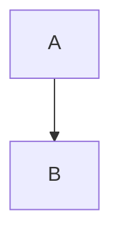

# Local Development Guide

[🇯🇵 日本語版](DEVELOPMENT.ja.md)

## Services

| Service        | Port | URL                           | Description      |
| -------------- | ---- | ----------------------------- | ---------------- |
| Blog (Next.js) | 3100 | <http://localhost:3100>       | Frontend         |
| Admin UI       | 3100 | <http://localhost:3100/admin> | Article manager  |
| CMS API        | 8787 | <http://localhost:8787>       | Backend API      |

## Quick Start

```bash
# 1. Setup (first time only)
just setup

# 2. Start all services
just dev-all

# 3. Open in browser
open http://localhost:3100
```

## Commands

### Development Servers

| Command         | Description              |
| --------------- | ------------------------ |
| `just dev-all`  | Start all services       |
| `just dev-blog` | Start blog only          |
| `just dev-api`  | Start CMS API only       |

### Database

| Command           | Description                                  |
| ----------------- | -------------------------------------------- |
| `just db-reset`   | Reset local D1 database                      |
| `just db-migrate` | Run all migrations                           |
| `just db-seed`    | Seed sample data                             |
| `just bootstrap`  | Run deps + reset + migrate + seed at once    |

### Dependencies

| Command     | Description    |
| ----------- | -------------- |
| `just deps` | pnpm install   |

### Utilities

| Command               | Description                    |
| --------------------- | ------------------------------ |
| `just kill-port 3100` | Kill process on specified port |

### Code Quality

| Command       | Description              |
| ------------- | ------------------------ |
| `just lint`   | Run Biome linter         |
| `just format` | Run Biome formatter      |
| `just check`  | Run Biome check          |
| `prek run -a` | Run all pre-commit hooks |

### Build and Test

| Command       | Description        |
| ------------- | ------------------ |
| `pnpm build`  | Build all packages |
| `just e2e`    | Run E2E tests      |
| `just e2e-ui` | Run E2E tests (UI) |

## Environment Variables

### Blog (apps/blog)

| Variable      | Description | Default                    |
| ------------- | ----------- | -------------------------- |
| `CMS_API_URL` | API URL     | `http://localhost:8787/v1` |
| `CMS_API_KEY` | API key     | (none)                     |

### CMS API (apps/cms-api)

| Variable                 | Description   | Default       |
| ------------------------ | ------------- | ------------- |
| `ENVIRONMENT`            | Environment   | `development` |
| `API_KEY`                | API auth key  | `dev-api-key` |
| `VERCEL_DEPLOY_HOOK_URL` | Deploy hook   | (none)        |

## Initial Data

Seed sample data to CMS:

```bash
# With CMS API running
just seed
```

## Local R2 (Wrangler)

Wrangler emulates R2 locally. No Docker required.

### Data Storage Location

```text
apps/cms-api/.wrangler/state/
```

### Image URLs

Local image URLs:

```text
http://localhost:8787/v1/images/file/{path}
```

## Troubleshooting

### Port in Use

```bash
# Check port usage
lsof -i :3100
lsof -i :8787

# Kill process
kill -9 <PID>
```

### Reset D1/R2 Data

```bash
just db-reset
just db-migrate
```

## Article Management

### Accessing Admin

1. Start development servers

   ```bash
   # Terminal 1
   just dev-api

   # Terminal 2
   just dev-blog
   ```

2. Access <http://localhost:3100/admin>

3. Login (development environment)

### Creating Articles

1. Click **New Article** in Admin
2. Fill in the fields:

   | Field        | Description                                  |
   | ------------ | -------------------------------------------- |
   | Title        | Article title                                |
   | Slug         | URL slug (auto-generated from title)         |
   | Description  | SEO description (100-160 chars recommended)  |
   | Tags         | Select or add new tags                       |
   | Header Image | Upload header image (optional)               |
   | Content      | Write content in Markdown                    |

3. Click **Save** to save as draft

### Publishing Articles

1. Click the Status badge (Draft/Published) to toggle
2. Click **Save**

Or use Publish/Unpublish buttons from the article list.

### Viewing Articles

Published articles available at:

```text
http://localhost:3100/article/{slug}
```

### Admin URLs

| URL                                                | Description  |
| -------------------------------------------------- | ------------ |
| <http://localhost:3100/admin>                      | Dashboard    |
| <http://localhost:3100/admin/articles>             | Article list |
| <http://localhost:3100/admin/articles/new>         | New article  |
| <http://localhost:3100/admin/articles/{slug}/edit> | Edit article |

### Markdown Syntax

The Content field supports these Markdown features:

| Syntax                    | Description        |
| ------------------------- | ------------------ |
| `# Heading 1`             | Headings (H1-H6)   |
| `**bold**`                | Bold               |
| `*italic*`                | Italic             |
| `~~strikethrough~~`       | Strikethrough      |
| `- item`                  | Unordered list     |
| `1. item`                 | Ordered list       |
| `> quote`                 | Blockquote         |
| `` `code` ``              | Inline code        |
| ``             | Image              |
| `[text](url)`             | Link               |

Code blocks:

````text
```typescript
const x = 1;
```
````

Supported languages: `typescript` `javascript` `python` `bash` `json` `yaml`
`go` `rust` etc.

Mermaid diagrams:

````text

````
