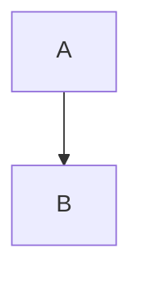

# zakki.app（仮）設計サマリ（現時点）

## 1️⃣ サービス全体の前提・思想 🧠

一人運用・多忙・運用コスト極小（ほぼゼロ）。

技術者向け。Wix的フルサポートはやらない。

GitHub Pages / Vercelに近い思想。
→「提供するが、使い方は自己責任」。

## 2️⃣ マルチテナント設計 🧩

テナント分離。

テナント判定はHostヘッダ（サブドメイン）。

例：tqer39.zakki.app。

パス・Cookie・Sessionでは切り替えない。

不変ルール（最重要）。

tenantはHostからのみ決定。

DB・検索・キャッシュキー・RSS・sitemap・OGP。
→すべてtenant_idを必須キーにする。

UIやAPIからtenantを受け取らない（改ざん防止）。

## 3️⃣ ドメイン・DNS方針 🌐

zakki.appを親ドメイン。

ワイルドカードDNS + Host判定。

*.zakki.app → 同一オリジン。

テナントごとにDNSレコードは作らない。

独自ドメイン（CNAME）は自己責任。

apex非対応。

設定ミスはサポートしない。

## 4️⃣ 記事フォーマット & インポート 📦

記事本文。

Markdownのみ。

生HTML（タグ）は一切許可しない。

.html / .js / .cssは記事データとして受け入れない。

許可拡張子。

記事：.md。

画像：png / jpg / webp / gif。

svgは禁止。

Markdown拡張。

fenced code blockによるrenderer指定方式。

- rendererは**オーナー（あなた）が実装**。
- **ホワイトリスト制**。
- 未知のrendererは「ただのコード表示」。

### rendererの制約（安全条件）

- 表示変換のみ（純関数）。
- JSを生成しない。
- 外部ネットワークアクセスなし。
- 出力はサニタイズ済みHTML / SVG。
- 入力サイズ制限あり。
- 既存rendererの意味は変更しない。
  → 変更時は `xxx-v2` を追加。

---

## 5️⃣ インポート方針 🔁

- **インポートの口だけ用意**。
- 作業はユーザー自己責任。

### API仕様（最小）

- `POST /import/dry-run`。
- `POST /import/commit`。
- Swagger + ドキュメント提供。

### 制限（コスト防衛）

- 記事数上限。
- zipサイズ上限。
- 実行頻度制限。
- エラーレポート返却（再実行可能）。

---

## 6️⃣ 検索 🔍

- **テナント内検索のみ**。
- D1 + FTS5採用。
- tenant_idフィルタ必須。
- 外部検索エンジンは使わない。
- 書き込み（再インデックス）頻度に注意。

---

## 7️⃣ レンダリング戦略 🖥️

### 現状

- 記事ページ：SSG。
- 管理画面：SSR。
- ISR未設定（新記事は再ビルドまで404）。

### 課題

- マルチテナント拡大時に**再ビルド運用が破綻**。
- → **ISRもしくはSSRへの移行が必要**。

---

## 8️⃣ セキュリティ（現状評価） 🔐

### 実装済み（良い）

- Admin / API認証。
- Cookie属性（httpOnly / sameSite / secure）。
- SQLi対策（prepared statement）。
- XSS対策（sanitize）。
- CSP / HSTS / 各種セキュリティヘッダ。
- レート制限。
- CORS制御。

### 指摘ポイント（重要）

- **Markdown生HTMLはsanitize以前に無効化すべき**。
- HSTS `includeSubDomains`は将来用途を考えて慎重に。
- レート制限はルート別・用途別に分ける。
- セキュリティサマリに**テナント境界の検証**が含まれていない。

---

## 9️⃣ 方針として確定したこと ✅

- タグ（HTML）は許可しない。
- renderer拡張はオーナーのみ実装。
- rendererはオプトイン可能。
- インポートは自己責任。
- 検索はテナント内限定。
- ワイルドカードDNS + Host判定。

---

## 🔚 残っている“決め切りタスク”

1. **テナント判定ロジックの実装場所を1箇所に集約**。
2. **Markdownパーサ設定（html:false）**。
3. ISR or SSR どちらに寄せるか決定。
4. 無料ユーザーの上限（記事数 / 検索回数）。
5. renderer初期セット（例：`mermaid`のみ）。

---

### 総評

ここまでの設計は**「一人運用SaaS」としてかなり現実的**。
危険なのは*実装*ではなく**「境界が曖昧になること」**だけ。

次にやるべきは
👉 **テナント境界のコードレベル固定**。
👉 **Markdown生HTMLの完全遮断**。

ここをやれば、設計としては「壊れにくい」段階に入ってる。

次はどこを詰める？
- テナント判定の実装。
- ISR/SSR切り替え。
- rendererの最初の1つ（mermaid）。
