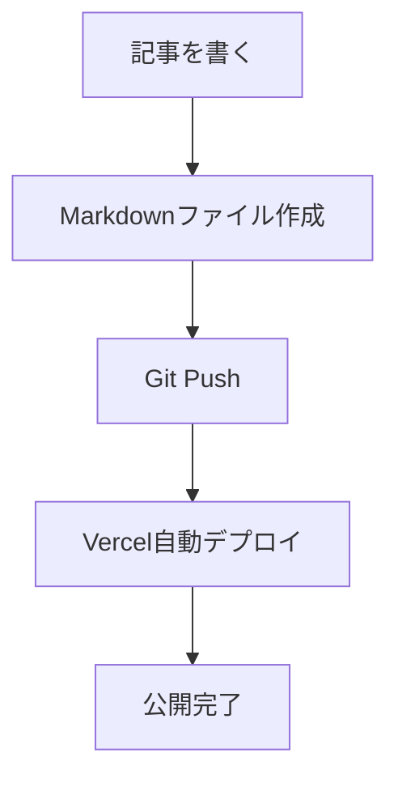
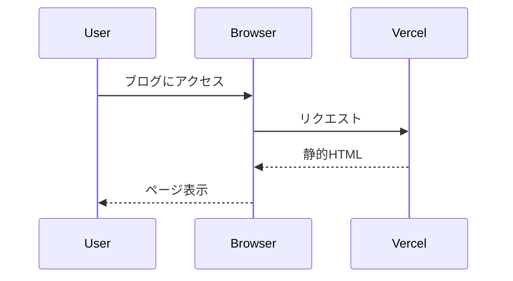

## はじめに

このブログを開設しました。技術的なトピックや日々の学びを共有していきます。

## 技術スタック

このブログは以下の技術で構築されています：

- **Next.js 14** - React フレームワーク
- **Tailwind CSS** - スタイリング
- **Markdown** - コンテンツ管理
- **Vercel** - ホスティング

## コードスニペットのテスト

TypeScriptのコード例：

```typescript:example.ts
interface Article {
  title: string;
  date: string;
  tags: string[];
}

function getLatestArticles(articles: Article[]): Article[] {
  return articles
    .sort((a, b) => (a.date > b.date ? -1 : 1))
    .slice(0, 5);
}
```

## Mermaid図表のテスト

フローチャートの例：



シーケンス図の例：



## まとめ

今後も継続的に記事を更新していく予定です。
